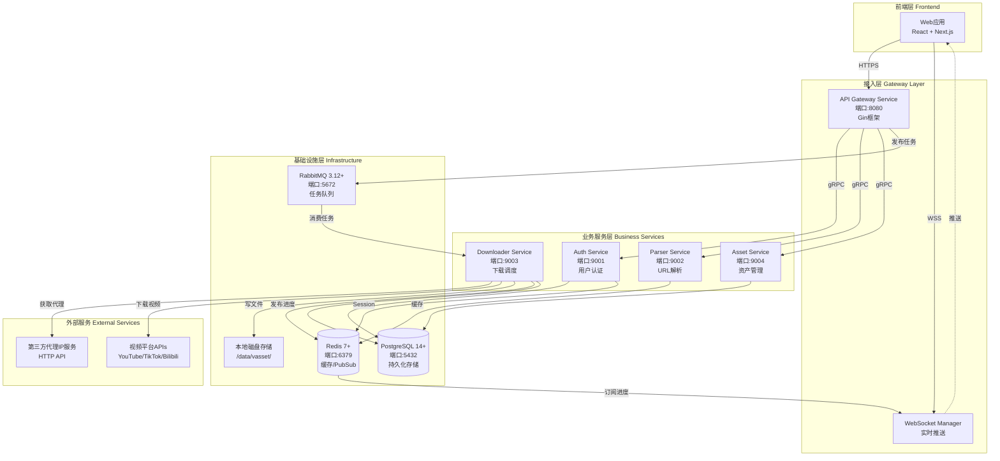
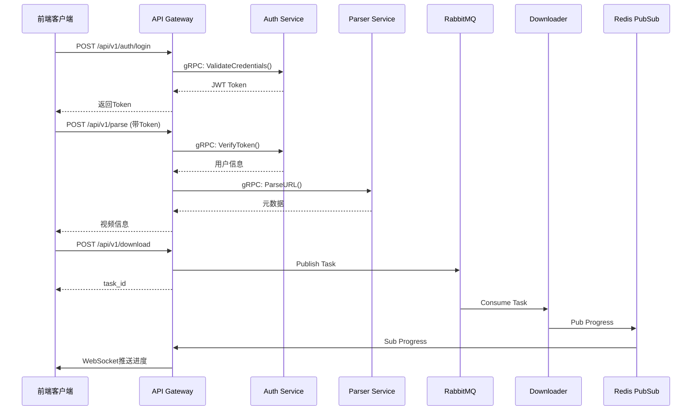
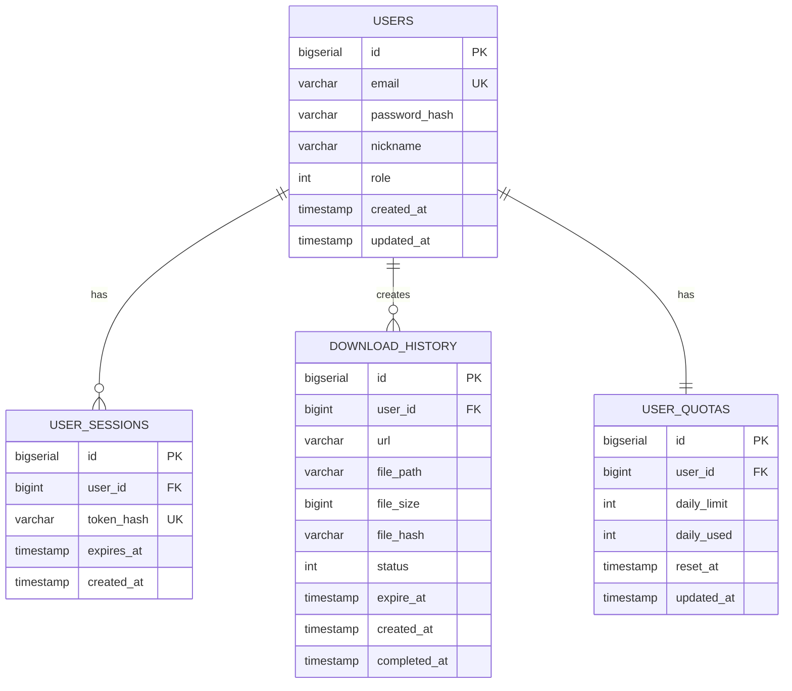
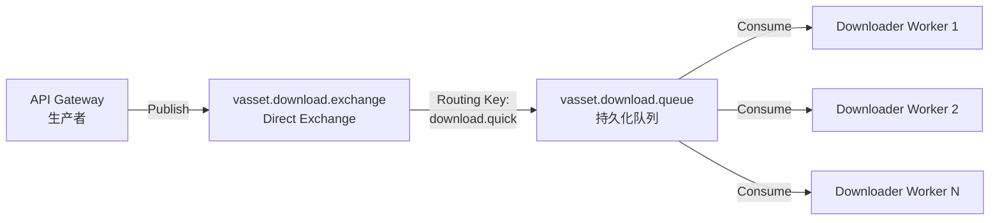
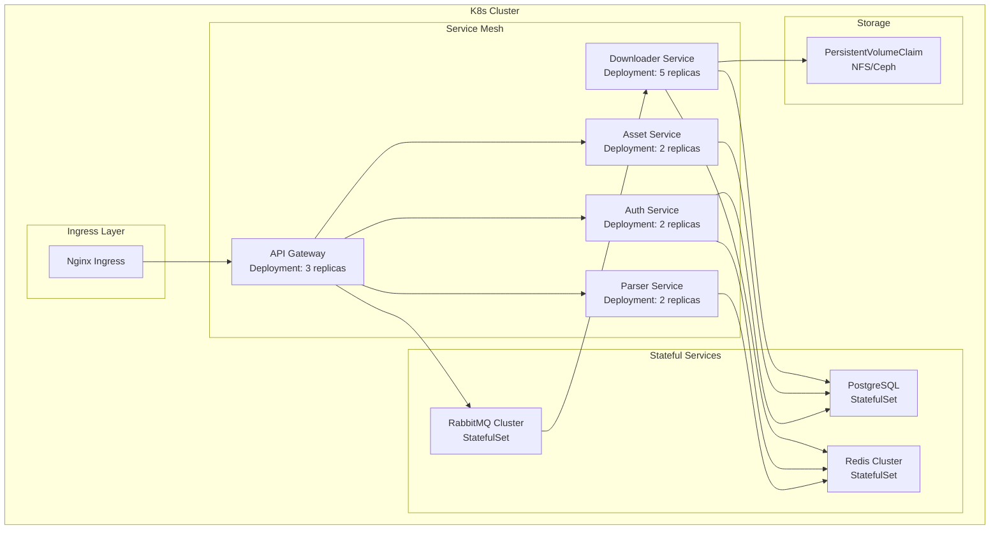
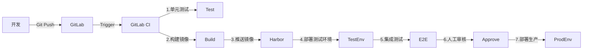
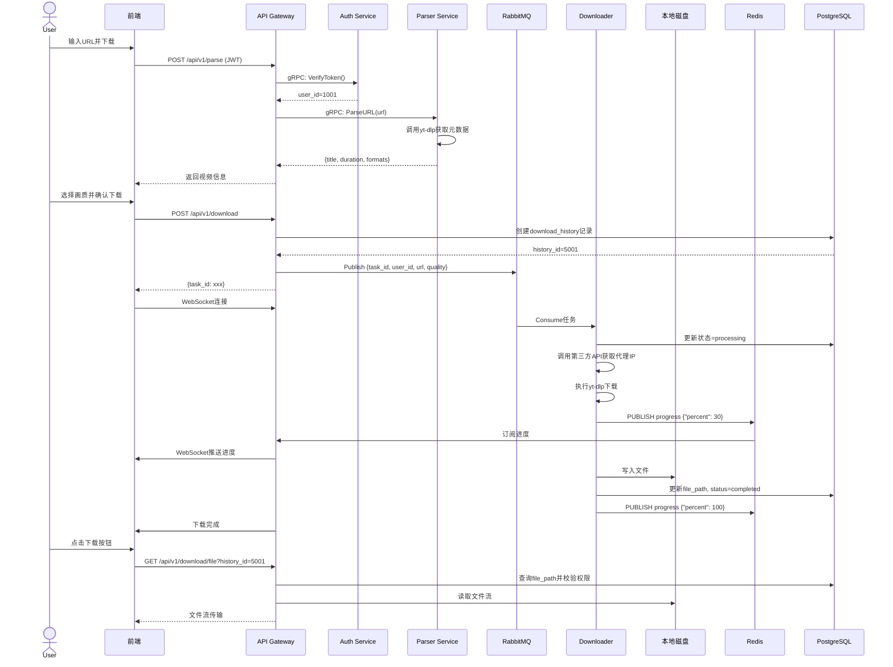

# V-Asset 后端系统 - 总体架构PRD

| 文档属性 | 详细信息 |
|:---|:---:|
| **文档版本** | V1.1.0 |
| **编写日期** | 2025-12-03 |
| **适用阶段** | MVP (Microservices Architecture) |
| **核心变更** | 存储:S3→本地磁盘; 代理:内部服务→直接调用第三方API |

---

## 1. 系统概述

### 1.1 产品定位
V-Asset是一个视频资产下载中台系统,为用户提供跨平台视频下载、元数据解析、文件归档管理等服务。

### 1.2 核心能力
- **多平台支持**: YouTube、TikTok、Bilibili等主流视频平台
- **智能代理**: 集成第三方代理IP服务,突破地域限制
- **双模式下载**: 极速下载(临时)和归档下载(永久)
- **实时进度**: WebSocket实时推送下载进度
- **配额管理**: 基于用户等级的下载配额控制

---

## 2. 微服务架构设计

### 2.1 系统架构图



### 2.2 服务清单

| 服务名称 | 端口 | 协议 | 核心职责 | 依赖服务 |
|:---|:---:|:---|:---|:---|
| **API Gateway** | 8080 | HTTP/gRPC | 统一接入、路由转发、认证拦截、文件下载代理 | Auth, Parser, Asset, RabbitMQ |
| **Auth Service** | 9001 | gRPC | 用户注册登录、JWT生成验证、权限管理 | PostgreSQL, Redis |
| **Parser Service** | 9002 | gRPC | URL解析、元数据提取、平台适配 | Redis (缓存) |
| **Downloader Service** | 9003 | gRPC/MQ | 任务调度、视频下载、代理管理、文件清理 | PostgreSQL, RabbitMQ, Redis, 第三方代理API |
| **Asset Service** | 9004 | gRPC | 下载历史、用户配额、数据统计 | PostgreSQL |

---

## 3. 服务间通信协议

### 3.1 通信方式设计



### 3.2 通信协议详细说明

#### A. HTTP/HTTPS (前端 ↔ Gateway)
- **用途**: 前端与API Gateway的主要通信协议
- **端口**: 8080 (开发), 443 (生产)
- **认证**: JWT Bearer Token
- **数据格式**: JSON

#### B. gRPC (微服务间)
- **用途**: 业务服务之间的高性能RPC调用
- **序列化**: Protocol Buffers (proto3)
- **连接**: 长连接,连接池复用
- **超时**: 默认5秒,可配置

#### C. RabbitMQ (异步任务)
- **用途**: 下载任务异步分发
- **交换机**: `vasset.download.exchange` (Direct)
- **队列**: `vasset.download.queue`
- **消息格式**: JSON
- **持久化**: 消息和队列都持久化
- **确认机制**: 手动ACK

#### D. Redis PubSub (实时推送)
- **用途**: 下载进度实时推送
- **频道命名**: `progress:{task_id}`
- **消息格式**: JSON
- **订阅方**: API Gateway WebSocket Manager

---

## 4. 基础设施设计

### 4.1 PostgreSQL数据库

#### 数据库架构
- **数据库名**: `vasset`
- **字符集**: UTF8
- **时区**: UTC
- **连接池**: 每服务最大100连接

#### 表归属划分



#### 表归属说明
- **`users`, `user_sessions`**: Auth Service主要管理
- **`download_history`**: Downloader Service写入,Asset Service读取(共享表)
- **`user_quotas`**: Asset Service管理

### 4.2 Redis设计

#### 用途分类
1. **缓存层**
   - 解析结果缓存: `parser:url:{md5}` TTL=1小时
   - 用户Token缓存: `auth:token:{hash}` TTL=24小时
   
2. **PubSub**
   - 进度推送频道: `progress:{task_id}`
   
3. **配额计数器**
   - 用户每日配额: `quota:daily:{user_id}:{date}` TTL=24小时

#### 数据结构设计
```
# 缓存示例
SET parser:url:abc123 '{"title":"video","duration":120}' EX 3600

# 配额计数器
INCR quota:daily:1001:20251203
EXPIRE quota:daily:1001:20251203 86400

# PubSub
PUBLISH progress:task_123 '{"percent":50,"speed":"2MB/s"}'
```

### 4.3 RabbitMQ设计

#### 队列架构


#### 消息格式
```json
{
  "task_id": "uuid-xxx-xxx",
  "user_id": 1001,
  "url": "https://youtube.com/watch?v=xxx",
  "mode": "quick_download",
  "quality": "1080p",
  "format": "mp4",
  "metadata": {
    "title": "video title",
    "duration": 120
  }
}
```

#### 可靠性保证
- **消息持久化**: `durable=true`
- **队列持久化**: `durable=true`
- **手动确认**: Worker处理完成后ACK
- **重试机制**: 失败消息重新入队,最多重试3次
- **死信队列**: `vasset.download.dlq` (Dead Letter Queue)

### 4.4 本地磁盘存储

#### 目录结构设计
```
/data/vasset/
├── tmp/                      # 极速下载(临时文件)
│   ├── {task_id}/           # 按任务ID隔离
│   │   └── video.mp4
│   └── ...
└── archive/                  # 归档下载(永久保存)
    ├── {user_id}/           # 按用户ID隔离
    │   ├── 20251203/        # 按日期分组
    │   │   ├── video1.mp4
    │   │   └── video2.mp4
    │   └── ...
    └── ...
```

#### 文件命名规则
- **极速下载**: `{task_id}/{sanitized_title}.{ext}`
- **归档下载**: `{user_id}/{YYYYMMDD}/{sanitized_title}_{timestamp}.{ext}`

#### 存储策略
| 下载模式 | 路径 | 保留时间 | 清理策略 |
|:---|:---|:---|:---|
| 极速下载 | `/data/vasset/tmp/` | 24小时 | 定时任务自动清理 |
| 归档下载 | `/data/vasset/archive/` | 永久 | 用户手动删除 |

#### 磁盘监控
- **监控指标**: 磁盘使用率、剩余空间
- **告警阈值**: 使用率 > 85%
- **清理触发**: 使用率 > 90% 时强制清理过期临时文件

---

## 5. 技术栈与开发规范

### 5.1 编程语言与框架

#### Go生态
```yaml
go_version: "1.21+"
frameworks:
  web: "gin-gonic/gin v1.9+"
  grpc: "google.golang.org/grpc v1.59+"
  orm: "gorm.io/gorm v1.25+"
  
libraries:
  jwt: "golang-jwt/jwt v5+"
  validator: "go-playground/validator v10+"
  logger: "uber-go/zap v1.26+"
  config: "spf13/viper v1.17+"
  redis: "go-redis/redis v9+"
  rabbitmq: "rabbitmq/amqp091-go v1.9+"
```

### 5.2 项目结构规范

```
service-name/
├── cmd/
│   └── main.go              # 服务入口
├── internal/
│   ├── handler/             # HTTP/gRPC处理器
│   ├── service/             # 业务逻辑层
│   ├── repository/          # 数据访问层
│   ├── model/               # 数据模型
│   ├── middleware/          # 中间件
│   └── config/              # 配置加载
├── pkg/                     # 可共享包
│   ├── jwt/
│   ├── logger/
│   └── validator/
├── proto/                   # gRPC定义
│   └── service.proto
├── migrations/              # 数据库迁移
│   └── 001_init.sql
├── config/                  # 配置文件
│   ├── dev.yaml
│   └── prod.yaml
├── Dockerfile
├── go.mod
└── README.md
```

### 5.3 代码规范

#### 命名规范
- **包名**: 全小写,单数形式 (如: `user`, `download`)
- **接口**: 以`er`结尾 (如: `Downloader`, `Parser`)
- **常量**: 驼峰或全大写 (如: `MaxRetryCount`)

#### 错误处理
```go
// 统一错误码设计
type ErrorCode int

const (
    ErrCodeSuccess        ErrorCode = 0
    ErrCodeInvalidParam   ErrorCode = 40001
    ErrCodeUnauthorized   ErrorCode = 40101
    ErrCodeNotFound       ErrorCode = 40401
    ErrCodeInternalError  ErrorCode = 50001
)
```

#### 日志规范
```go
// 使用结构化日志
logger.Info("download started",
    zap.String("task_id", taskID),
    zap.String("url", url),
    zap.Int64("user_id", userID),
)
```

### 5.4 API版本管理
- **URL版本**: `/api/v1/`, `/api/v2/`
- **向后兼容**: V1接口保持6个月兼容期
- **弃用标记**: 响应头 `X-API-Deprecated: true`

---

## 6. 跨服务非功能性需求

### 6.1 性能指标

| 指标 | 目标值 | 说明 |
|:---|:---|:---|
| API响应时间(P95) | < 200ms | 不含下载任务执行时间 |
| API响应时间(P99) | < 500ms | - |
| gRPC调用延迟(P95) | < 50ms | 微服务间通信 |
| WebSocket推送延迟 | < 100ms | 进度更新推送 |
| 并发下载任务数 | 50+ | 受Worker池大小限制 |
| 数据库连接池 | 100/服务 | 每个服务的最大连接数 |

### 6.2 安全要求

#### 认证与授权
- **JWT有效期**: 24小时
- **Token刷新**: 支持Refresh Token,有效期7天
- **密码策略**: 最少8字符,包含字母数字
- **密码加密**: bcrypt, cost=10

#### 数据传输
- **HTTPS**: 全站强制HTTPS
- **TLS版本**: TLS 1.2+
- **证书**: Let's Encrypt自动续期

#### 敏感数据
- **密码**: bcrypt加密存储
- **日志脱敏**: 不记录完整URL参数、Token
- **数据库**: 启用SSL连接

### 6.3 可用性与容错

#### 服务可用性
- **MVP目标**: 99% (月故障时间 < 7.2小时)
- **生产目标**: 99.9% (月故障时间 < 43分钟)

#### 超时与重试
```yaml
timeouts:
  http_request: 30s
  grpc_call: 5s
  database_query: 10s
  download_task: 30m
  
retry_policy:
  max_retries: 3
  backoff: exponential
  initial_interval: 1s
  max_interval: 30s
```

#### 熔断策略
- **熔断条件**: 错误率 > 50% 且请求数 > 20
- **熔断时长**: 30秒
- **半开状态**: 允许3个请求探测恢复

### 6.4 监控与告警

#### 监控指标
```yaml
metrics:
  business:
    - download_task_total
    - download_task_success_rate
    - active_download_count
    - user_quota_usage
    
  system:
    - cpu_usage_percent
    - memory_usage_percent
    - disk_usage_percent
    - network_bandwidth
    
  middleware:
    - database_connection_pool
    - redis_hit_rate
    - rabbitmq_queue_depth
```

#### 告警规则
| 告警项 | 阈值 | 级别 | 通知方式 |
|:---|:---|:---|:---|
| API错误率 | > 5% | P1 | 电话+短信 |
| 下载成功率 | < 80% | P2 | 邮件+IM |
| 磁盘使用率 | > 85% | P2 | 邮件 |
| 队列堆积 | > 1000 | P3 | IM |

---

## 7. 部署架构

### 7.1 MVP部署方案 (Docker Compose)

```yaml
version: '3.8'
services:
  # 基础设施
  postgres:
    image: postgres:14
    ports: ["5432:5432"]
    volumes: ["./data/postgres:/var/lib/postgresql/data"]
    
  redis:
    image: redis:7-alpine
    ports: ["6379:6379"]
    
  rabbitmq:
    image: rabbitmq:3.12-management
    ports: ["5672:5672", "15672:15672"]
    
  # 业务服务
  api-gateway:
    build: ./services/api-gateway
    ports: ["8080:8080"]
    depends_on: [postgres, redis, rabbitmq]
    
  auth-service:
    build: ./services/auth
    ports: ["9001:9001"]
    depends_on: [postgres, redis]
    
  parser-service:
    build: ./services/parser
    ports: ["9002:9002"]
    depends_on: [redis]
    
  downloader-service:
    build: ./services/downloader
    ports: ["9003:9003"]
    volumes: ["/data/vasset:/data/vasset"]
    depends_on: [postgres, redis, rabbitmq]
    
  asset-service:
    build: ./services/asset
    ports: ["9004:9004"]
    depends_on: [postgres]
```

### 7.2 生产环境架构 (Kubernetes)



---

## 8. 开发流程与环境

### 8.1 环境划分
- **本地开发**: localhost, Docker Compose
- **测试环境**: test.vasset.internal
- **预发布环境**: staging.vasset.com
- **生产环境**: api.vasset.com

### 8.2 CI/CD流程


---

## 9. 数据流与核心流程

### 9.1 完整下载流程



---

## 10. 附录

### 10.1 术语表
| 术语 | 说明 |
|:---|:---|
| MVP | Minimum Viable Product,最小可行产品 |
| gRPC | Google Remote Procedure Call,高性能RPC框架 |
| JWT | JSON Web Token,无状态认证令牌 |
| TTL | Time To Live,生存时间 |
| PubSub | Publish/Subscribe,发布订阅模式 |
| ACK | Acknowledge,消息确认 |
| DLQ | Dead Letter Queue,死信队列 |

### 10.2 参考文档
- [Go项目结构规范](https://github.com/golang-standards/project-layout)
- [gRPC官方文档](https://grpc.io/docs/)
- [yt-dlp文档](https://github.com/yt-dlp/yt-dlp)
- [RabbitMQ最佳实践](https://www.rabbitmq.com/tutorials)

---

**文档维护**: 本文档作为所有微服务PRD的总纲,任何架构级变更需同步更新此文档。
