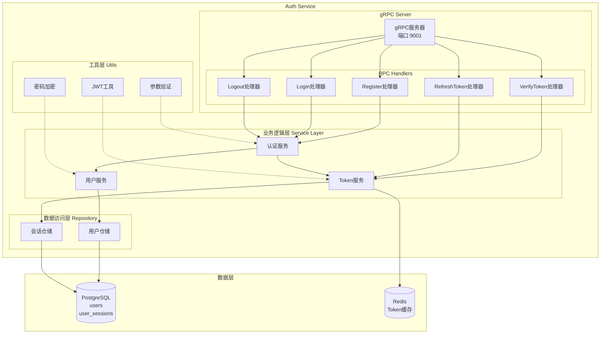
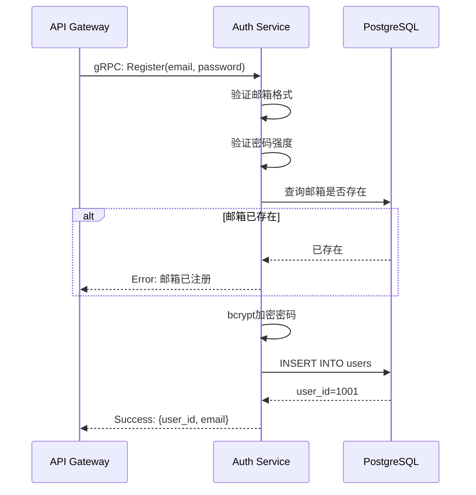
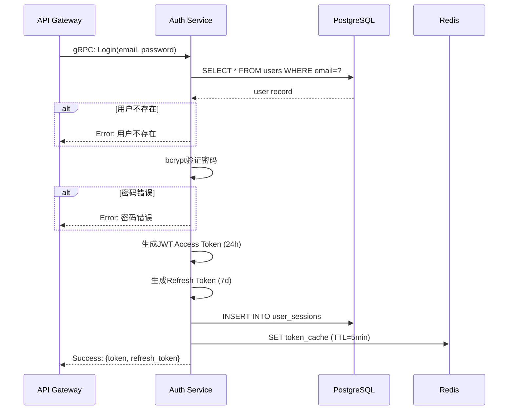
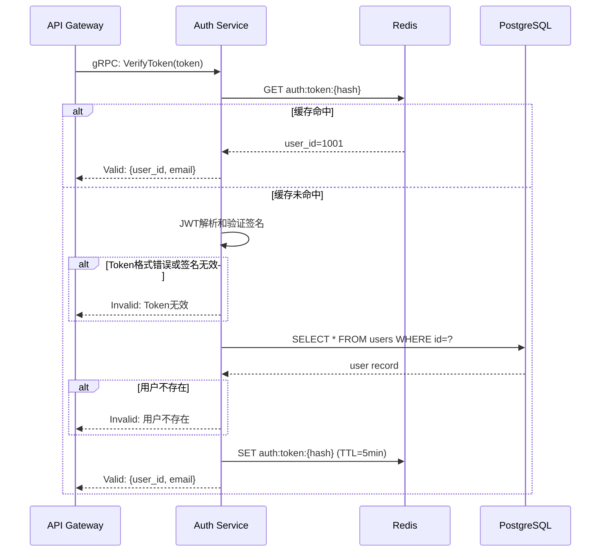

# Auth Service - 详细设计PRD

| 文档属性 | 详细信息 |
|:---|:---:|
| **服务名称** | Auth Service (认证鉴权服务) |
| **版本** | V1.0.0 |
| **端口** | 9001 (gRPC) |
| **依赖服务** | PostgreSQL, Redis |

---

## 1. 服务概述

### 1.1 职责定义
Auth Service负责系统的用户认证和鉴权,核心职责包括:
- **用户管理**: 用户注册、登录、信息管理
- **Token管理**: JWT Token生成、验证、刷新
- **会话管理**: 用户会话跟踪和管理
- **权限验证**: 用户角色和权限校验

### 1.2 核心特性
- 基于JWT的无状态认证
- bcrypt密码加密存储
- Redis缓存Token验证
- Refresh Token支持
- 多端登录管理

---

## 2. 架构设计

### 2.1 服务架构图



### 2.2 认证流程

#### 注册流程


#### 登录流程


#### Token验证流程


---

## 3. 功能模块

### 3.1 用户注册

#### 注册验证规则
- **邮箱**: 必须符合RFC 5322标准
- **密码**:
  - 最短8字符
  - 至少包含1个大写字母
  - 至少包含1个小写字母
  - 至少包含1个数字
  - 可选:特殊字符
- **昵称**: 2-30字符,可选

#### 代码实现示例
```go
func (s *AuthService) Register(ctx context.Context, req *pb.RegisterRequest) (*pb.RegisterResponse, error) {
    // 1. 参数验证
    if err := s.validator.Validate(req); err != nil {
        return nil, status.Error(codes.InvalidArgument, err.Error())
    }
    
    // 2. 检查邮箱是否已注册
    exists, err := s.userRepo.EmailExists(ctx, req.Email)
    if err != nil {
        return nil, status.Error(codes.Internal, "database error")
    }
    if exists {
        return nil, status.Error(codes.AlreadyExists, "email already registered")
    }
    
    // 3. 密码加密
    hashedPassword, err := bcrypt.GenerateFromPassword([]byte(req.Password), bcrypt.DefaultCost)
    if err != nil {
        return nil, status.Error(codes.Internal, "password encryption failed")
    }
    
    // 4. 创建用户
    user := &model.User{
        Email:        req.Email,
        PasswordHash: string(hashedPassword),
        Nickname:     req.Nickname,
        Role:         model.RoleUser,
        CreatedAt:    time.Now(),
    }
    
    if err := s.userRepo.Create(ctx, user); err != nil {
        return nil, status.Error(codes.Internal, "failed to create user")
    }
    
    return &pb.RegisterResponse{
        UserId:   user.ID,
        Email:    user.Email,
        Nickname: user.Nickname,
    }, nil
}
```

### 3.2 用户登录

#### JWT Payload结构
```go
type Claims struct {
    UserID   int64  `json:"user_id"`
    Email    string `json:"email"`
    Role     string `json:"role"`
    jwt.RegisteredClaims
}
```

#### Token生成
```go
func (s *TokenService) GenerateToken(user *model.User) (string, error) {
    now := time.Now()
    claims := Claims{
        UserID: user.ID,
        Email:  user.Email,
        Role:   user.Role,
        RegisteredClaims: jwt.RegisteredClaims{
            ExpiresAt: jwt.NewNumericDate(now.Add(24 * time.Hour)),
            IssuedAt:  jwt.NewNumericDate(now),
            NotBefore: jwt.NewNumericDate(now),
            Issuer:    "vasset-auth",
        },
    }
    
    token := jwt.NewWithClaims(jwt.SigningMethodHS256, claims)
    return token.SignedString([]byte(s.config.JWTSecret))
}
```

### 3.3 Token验证

#### 验证逻辑
```go
func (s *TokenService) VerifyToken(ctx context.Context, tokenString string) (*Claims, error) {
    // 1. 检查Redis缓存
    cacheKey := fmt.Sprintf("auth:token:%s", hashToken(tokenString))
    cached, err := s.redis.Get(ctx, cacheKey).Result()
    
    if err == nil {
        // 缓存命中,解析Claims
        var claims Claims
        json.Unmarshal([]byte(cached), &claims)
        return &claims, nil
    }
    
    // 2. 解析JWT
    token, err := jwt.ParseWithClaims(tokenString, &Claims{}, func(token *jwt.Token) (interface{}, error) {
        if _, ok := token.Method.(*jwt.SigningMethodHMAC); !ok {
            return nil, fmt.Errorf("unexpected signing method")
        }
        return []byte(s.config.JWTSecret), nil
    })
    
    if err != nil || !token.Valid {
        return nil, errors.New("invalid token")
    }
    
    claims, ok := token.Claims.(*Claims)
    if !ok {
        return nil, errors.New("invalid claims")
    }
    
    // 3. 写入缓存(TTL=5分钟)
    claimsJSON, _ := json.Marshal(claims)
    s.redis.Set(ctx, cacheKey, claimsJSON, 5*time.Minute)
    
    return claims, nil
}
```

### 3.4 Refresh Token

#### 刷新流程
```go
func (s *TokenService) RefreshToken(ctx context.Context, refreshToken string) (string, error) {
    // 1. 查询session表验证refresh_token
    session, err := s.sessionRepo.FindByRefreshToken(ctx, refreshToken)
    if err != nil {
        return "", errors.New("invalid refresh token")
    }
    
    // 2. 检查是否过期
    if session.ExpiresAt.Before(time.Now()) {
        return "", errors.New("refresh token expired")
    }
    
    // 3. 获取用户信息
    user, err := s.userRepo.FindByID(ctx, session.UserID)
    if err != nil {
        return "", errors.New("user not found")
    }
    
    // 4. 生成新的Access Token
    newToken, err := s.GenerateToken(user)
    if err != nil {
        return "", err
    }
    
    // 5. 更新session的最后使用时间
    session.LastUsedAt = time.Now()
    s.sessionRepo.Update(ctx, session)
    
    return newToken, nil
}
```

### 3.5 登出

#### 登出处理
```go
func (s *AuthService) Logout(ctx context.Context, req *pb.LogoutRequest) (*pb.LogoutResponse, error) {
    // 1. 从Redis删除Token缓存
    cacheKey := fmt.Sprintf("auth:token:%s", hashToken(req.Token))
    s.redis.Del(ctx, cacheKey)
    
    // 2. 删除数据库session记录
    err := s.sessionRepo.DeleteByToken(ctx, req.Token)
    if err != nil {
        logger.Error("failed to delete session", zap.Error(err))
    }
    
    return &pb.LogoutResponse{
        Success: true,
    }, nil
}
```

---

## 4. 数据库设计

### 4.1 Users表

```sql
CREATE TABLE users (
    id            BIGSERIAL PRIMARY KEY,
    email         VARCHAR(255) NOT NULL UNIQUE,
    password_hash VARCHAR(255) NOT NULL,
    nickname      VARCHAR(100),
    avatar_url    VARCHAR(500),
    role          INT NOT NULL DEFAULT 1,  -- 1:普通用户,2:VIP,99:管理员
    status        INT NOT NULL DEFAULT 1,  -- 1:正常,0:禁用
    created_at    TIMESTAMP NOT NULL DEFAULT CURRENT_TIMESTAMP,
    updated_at    TIMESTAMP NOT NULL DEFAULT CURRENT_TIMESTAMP,
    last_login_at TIMESTAMP,
    
    INDEX idx_email (email),
    INDEX idx_status (status),
    INDEX idx_created_at (created_at)
);
```

#### 字段说明
| 字段 | 类型 | 说明 |
|:---|:---|:---|
| `id` | BIGSERIAL | 用户ID,主键 |
| `email` | VARCHAR(255) | 邮箱,唯一索引 |
| `password_hash` | VARCHAR(255) | bcrypt加密的密码 |
| `nickname` | VARCHAR(100) | 昵称,可空 |
| `avatar_url` | VARCHAR(500) | 头像URL,可空 |
| `role` | INT | 用户角色: 1=普通,2=VIP,99=管理员 |
| `status` | INT | 账号状态: 1=正常,0=禁用 |
| `created_at` | TIMESTAMP | 注册时间 |
| `updated_at` | TIMESTAMP | 最后更新时间 |
| `last_login_at` | TIMESTAMP | 最后登录时间 |

### 4.2 User_Sessions表

```sql
CREATE TABLE user_sessions (
    id            BIGSERIAL PRIMARY KEY,
    user_id       BIGINT NOT NULL,
    refresh_token VARCHAR(255) NOT NULL UNIQUE,
    token_hash    VARCHAR(64) NOT NULL,  -- SHA256(access_token)
    device_info   TEXT,                   -- User-Agent等设备信息
    ip_address    INET,
    expires_at    TIMESTAMP NOT NULL,
    last_used_at  TIMESTAMP NOT NULL DEFAULT CURRENT_TIMESTAMP,
    created_at    TIMESTAMP NOT NULL DEFAULT CURRENT_TIMESTAMP,
    
    FOREIGN KEY (user_id) REFERENCES users(id) ON DELETE CASCADE,
    INDEX idx_user_id (user_id),
    INDEX idx_refresh_token (refresh_token),
    INDEX idx_expires_at (expires_at)
);
```

#### 字段说明
| 字段 | 类型 | 说明 |
|:---|:---|:---|
| `id` | BIGSERIAL | 会话ID |
| `user_id` | BIGINT | 关联用户ID |
| `refresh_token` | VARCHAR(255) | Refresh Token,唯一 |
| `token_hash` | VARCHAR(64) | Access Token的SHA256哈希 |
| `device_info` | TEXT | 设备信息(User-Agent) |
| `ip_address` | INET | 登录IP |
| `expires_at` | TIMESTAMP | Refresh Token过期时间 |
| `last_used_at` | TIMESTAMP | 最后使用时间 |
| `created_at` | TIMESTAMP | 创建时间 |

### 4.3 数据库索引优化

#### 索引策略
```sql
-- Users表
CREATE INDEX idx_users_email ON users(email);              -- 登录查询
CREATE INDEX idx_users_status ON users(status);            -- 状态过滤
CREATE INDEX idx_users_role ON users(role);                -- 角色查询

-- Sessions表
CREATE INDEX idx_sessions_user_id ON user_sessions(user_id);              -- 用户会话查询
CREATE INDEX idx_sessions_refresh_token ON user_sessions(refresh_token);  -- Token刷新
CREATE INDEX idx_sessions_expires_at ON user_sessions(expires_at);        -- 过期清理
```

---

## 5. 接口设计 (gRPC)

### 5.1 Proto定义

```protobuf
syntax = "proto3";

package auth;

option go_package = "vasset/auth/pb";

service AuthService {
  // 用户注册
  rpc Register(RegisterRequest) returns (RegisterResponse);
  
  // 用户登录
  rpc Login(LoginRequest) returns (LoginResponse);
  
  // Token验证
  rpc VerifyToken(VerifyTokenRequest) returns (VerifyTokenResponse);
  
  // Token刷新
  rpc RefreshToken(RefreshTokenRequest) returns (RefreshTokenResponse);
  
  // 登出
  rpc Logout(LogoutRequest) returns (LogoutResponse);
  
  // 获取用户信息
  rpc GetUserInfo(GetUserInfoRequest) returns (GetUserInfoResponse);
}

// 注册请求
message RegisterRequest {
  string email = 1;
  string password = 2;
  string nickname = 3;
}

message RegisterResponse {
  int64 user_id = 1;
  string email = 2;
  string nickname = 3;
}

// 登录请求
message LoginRequest {
  string email = 1;
  string password = 2;
  string device_info = 3;  // 可选:设备信息
  string ip_address = 4;   // 可选:IP地址
}

message LoginResponse {
  string token = 1;           // Access Token
  string refresh_token = 2;   // Refresh Token
  int64 expires_in = 3;       // Token有效期(秒)
  User user = 4;
}

// Token验证请求
message VerifyTokenRequest {
  string token = 1;
}

message VerifyTokenResponse {
  bool valid = 1;
  int64 user_id = 2;
  string email = 3;
  string role = 4;
}

// Token刷新请求
message RefreshTokenRequest {
  string refresh_token = 1;
}

message RefreshTokenResponse {
  string token = 1;
  int64 expires_in = 2;
}

// 登出请求
message LogoutRequest {
  string token = 1;
}

message LogoutResponse {
  bool success = 1;
}

// 获取用户信息请求
message GetUserInfoRequest {
  int64 user_id = 1;
}

message GetUserInfoResponse {
  User user = 1;
}

// 用户信息
message User {
  int64 user_id = 1;
  string email = 2;
  string nickname = 3;
  string avatar_url = 4;
  int32 role = 5;
  string created_at = 6;
}
```

---

## 6. 配置管理

### 6.1 配置文件示例 (config/dev.yaml)
```yaml
server:
  port: 9001
  
database:
  host: localhost
  port: 5432
  user: vasset
  password: password
  dbname: vasset
  sslmode: disable
  max_open_conns: 100
  max_idle_conns: 10
  conn_max_lifetime: 3600s

redis:
  addr: localhost:6379
  password: ""
  db: 0
  pool_size: 50
  
jwt:
  secret: "your-secret-key-change-in-production"
  access_token_ttl: 86400    # 24小时
  refresh_token_ttl: 604800  # 7天
  
password:
  bcrypt_cost: 10
  min_length: 8
  require_uppercase: true
  require_lowercase: true
  require_number: true
  require_special: false

session:
  max_sessions_per_user: 5  # 每个用户最多5个并发会话
  cleanup_interval: 3600     # 每小时清理过期会话
```

---

## 7. 非功能性需求

### 7.1 安全要求

#### 密码安全
- **加密算法**: bcrypt (cost=10)
- **密码策略**:
  - 最短8字符
  - 包含大小写字母和数字
  - 禁止使用常见弱密码(通过黑名单检查)

#### Token安全
- **签名算法**: HS256 (HMAC-SHA256)
- **密钥长度**: 至少32字节
- **Token过期**: Access Token 24小时, Refresh Token 7天
- **Token撤销**: 支持通过Redis删除缓存实现即时撤销

#### 防暴力破解
```go
// 限制登录失败次数
func (s *AuthService) checkLoginAttempts(ctx context.Context, email string) error {
    key := fmt.Sprintf("login:attempts:%s", email)
    attempts, _ := s.redis.Get(ctx, key).Int()
    
    if attempts >= 5 {
        return errors.New("账号已锁定,请30分钟后重试")
    }
    
    return nil
}

func (s *AuthService) recordFailedLogin(ctx context.Context, email string) {
    key := fmt.Sprintf("login:attempts:%s", email)
    s.redis.Incr(ctx, key)
    s.redis.Expire(ctx, key, 30*time.Minute)
}
```

### 7.2 性能指标
- **注册接口**: P95 < 100ms
- **登录接口**: P95 < 150ms (含密码验证)
- **Token验证**: P95 < 10ms (Redis缓存命中)
- **并发处理**: 1000+ QPS

### 7.3 可用性
- **数据库连接池**: 最大100连接
- **Redis连接池**: 50连接
- **超时控制**: 数据库查询10秒,Redis操作1秒
- **降级策略**: Redis不可用时直接查询数据库,不影响核心功能

---

## 8. 监控与告警

### 8.1 监控指标
```yaml
metrics:
  business:
    - auth_register_total (注册总数)
    - auth_login_total (登录总数)
    - auth_login_failed_total (登录失败数)
    - auth_token_verify_total (Token验证数)
    - auth_active_sessions (活跃会话数)
    
  performance:
    - auth_grpc_duration_seconds (gRPC调用延迟)
    - auth_db_query_duration_seconds (数据库查询延迟)
    - auth_redis_hit_rate (Redis缓存命中率)
```

### 8.2 告警规则
| 告警项 | 阈值 | 级别 |
|:---|:---|:---|
| 登录失败率 | > 20% | P2 |
| Token验证失败率 | > 10% | P2 |
| gRPC调用延迟(P95) | > 100ms | P3 |
| Redis缓存命中率 | < 80% | P3 |
| 数据库连接池耗尽 | 可用连接 < 10 | P1 |

---

## 9. 部署与运维

### 9.1 健康检查
```go
func (s *AuthService) HealthCheck(ctx context.Context, req *pb.HealthCheckRequest) (*pb.HealthCheckResponse, error) {
    // 检查数据库连接
    if err := s.db.Ping(); err != nil {
        return &pb.HealthCheckResponse{Status: "unhealthy", Message: "database unavailable"}, nil
    }
    
    // 检查Redis连接
    if err := s.redis.Ping(ctx).Err(); err != nil {
        return &pb.HealthCheckResponse{Status: "degraded", Message: "redis unavailable"}, nil
    }
    
    return &pb.HealthCheckResponse{Status: "healthy"}, nil
}
```

### 9.2 日志规范
```json
{
  "timestamp": "2025-12-03T10:30:00Z",
  "level": "info",
  "service": "auth-service",
  "method": "Login",
  "user_id": 1001,
  "email": "user@example.com",
  "ip": "192.168.1.100",
  "success": true,
  "latency_ms": 85
}
```

---

**下一步**: 查看其他微服务PRD文档以了解完整的认证集成方案。
