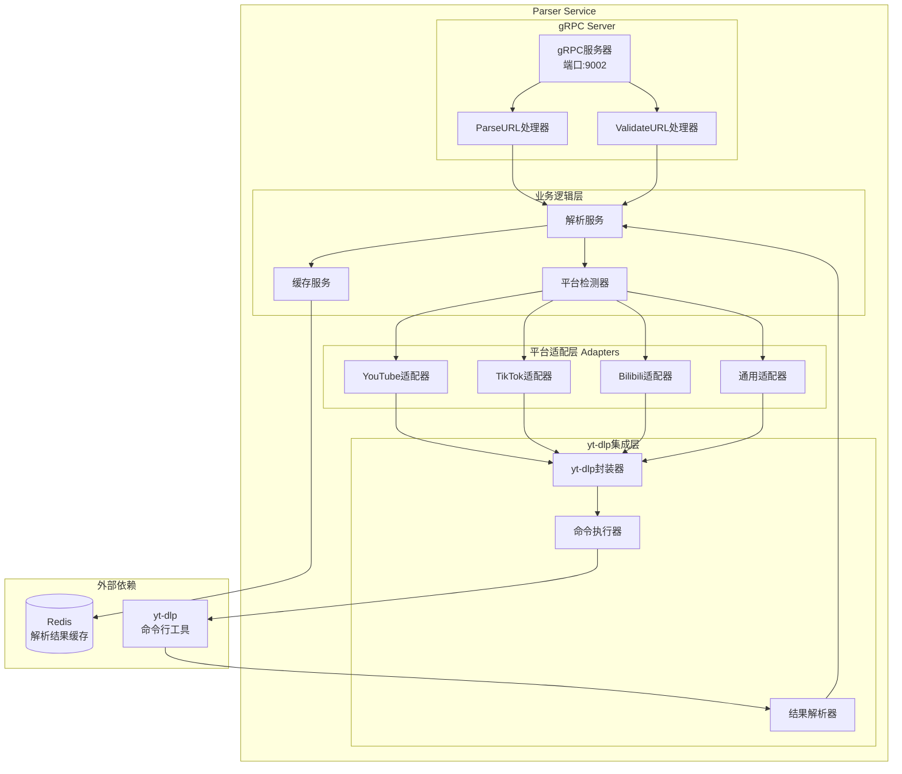
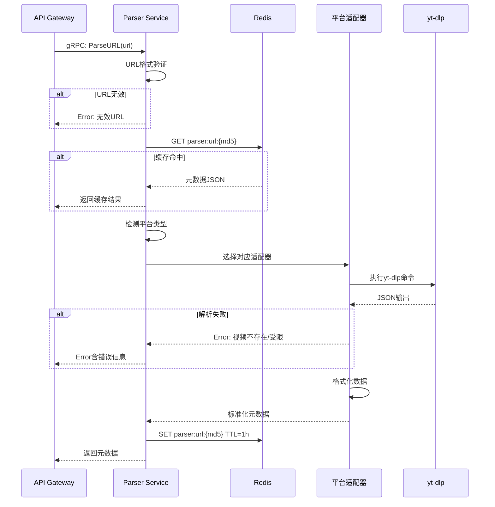

# Parser Service - 详细设计PRD

| 文档属性 | 详细信息 |
|:---|:---:|
| **服务名称** | Parser Service (元数据解析服务) |
| **版本** | V1.0.0 |
| **端口** | 9002 (gRPC) |
| **依赖服务** | Redis |

---

## 1. 服务概述

### 1.1 职责定义
Parser Service负责视频URL的解析和元数据提取,核心职责包括:
- **URL解析**: 识别视频平台并提取视频ID
- **元数据提取**: 获取标题、时长、分辨率等信息
- **格式选择**: 提供可用的视频格式列表
- **平台适配**: 支持多个视频平台的统一接口

### 1.2 支持平台
- **YouTube**: 全球最大视频平台
- **TikTok**: 短视频平台
- **Bilibili**: 中国视频平台
- **Twitter/X**: 社交媒体视频
- **Instagram**: 图片和视频分享
- **更多**: 通过yt-dlp支持1000+平台

---

## 2. 架构设计

### 2.1 服务架构图



### 2.2 解析流程



---

## 3. 功能模块

### 3.1 平台检测

#### URL Pattern匹配
```go
type PlatformDetector struct {
    patterns map[string]*regexp.Regexp
}

func NewPlatformDetector() *PlatformDetector {
    return &PlatformDetector{
        patterns: map[string]*regexp.Regexp{
            "youtube":  regexp.MustCompile(`^https?://(www\.)?(youtube\.com|youtu\.be)/`),
            "tiktok":   regexp.MustCompile(`^https?://.*tiktok\.com/`),
            "bilibili": regexp.MustCompile(`^https?://.*bilibili\.com/`),
            "twitter":  regexp.MustCompile(`^https?://(www\.)?(twitter\.com|x\.com)/`),
            "instagram": regexp.MustCompile(`^https?://(www\.)?instagram\.com/`),
        },
    }
}

func (d *PlatformDetector) Detect(url string) (string, error) {
    for platform, pattern := range d.patterns {
        if pattern.MatchString(url) {
            return platform, nil
        }
    }
    return "generic", nil
}
```

### 3.2 yt-dlp集成

#### 命令执行
```go
func (w *YTDLPWrapper) ExtractInfo(url string) (*VideoInfo, error) {
    cmd := exec.Command("yt-dlp",
        "--dump-json",           // 输出JSON
        "--no-playlist",         // 不解析播放列表
        "--skip-download",       // 不下载视频
        "--timeout", "30",       // 超时30秒
        url,
    )
    
    // 设置超时
    ctx, cancel := context.WithTimeout(context.Background(), 35*time.Second)
    defer cancel()
    cmd = exec.CommandContext(ctx, cmd.Path, cmd.Args[1:]...)
    
    // 执行命令
    output, err := cmd.CombinedOutput()
    if err != nil {
        return nil, fmt.Errorf("yt-dlp failed: %w, output: %s", err, output)
    }
    
    // 解析JSON
    var info VideoInfo
    if err := json.Unmarshal(output, &info); err != nil {
        return nil, fmt.Errorf("failed to parse yt-dlp output: %w", err)
    }
    
    return &info, nil
}
```

#### yt-dlp返回结构
```go
type VideoInfo struct {
    ID          string   `json:"id"`
    Title       string   `json:"title"`
    Description string   `json:"description"`
    Duration    int64    `json:"duration"`       // 秒
    Thumbnail   string   `json:"thumbnail"`
    Uploader    string   `json:"uploader"`
    UploadDate  string   `json:"upload_date"`    // YYYYMMDD
    ViewCount   int64    `json:"view_count"`
    Formats     []Format `json:"formats"`
}

type Format struct {
    FormatID   string  `json:"format_id"`
    URL        string  `json:"url"`
    Ext        string  `json:"ext"`              // mp4, webm, etc.
    Resolution string  `json:"resolution"`       // 1920x1080
    Filesize   int64   `json:"filesize"`
    FPS        float64 `json:"fps"`
    VCodec     string  `json:"vcodec"`           // h264, vp9, etc.
    ACodec     string  `json:"acodec"`           // aac, opus, etc.
}
```

### 3.3 数据标准化

#### 格式转换
```go
func (s *ParserService) NormalizeFormats(rawFormats []Format) []NormalizedFormat {
    var result []NormalizedFormat
    
    // 过滤掉音频only和无效格式
    for _, f := range rawFormats {
        if f.VCodec == "none" {
            continue
        }
        
        // 提取分辨率高度
        height := extractHeight(f.Resolution)
        if height == 0 {
            continue
        }
        
        // 计算优先级得分(分辨率+编码+文件大小)
        score := calculateScore(f)
        
        result = append(result, NormalizedFormat{
            FormatID:   f.FormatID,
            Quality:    formatQuality(height),  // 1080p, 720p, etc.
            Extension:  f.Ext,
            Filesize:   f.Filesize,
            Height:     height,
            FPS:        f.FPS,
            VideoCodec: f.VCodec,
            AudioCodec: f.ACodec,
            Score:      score,
        })
    }
    
    // 按得分排序
    sort.Slice(result, func(i, j int) bool {
        return result[i].Score > result[j].Score
    })
    
    return result
}

func formatQuality(height int) string {
    switch {
    case height >= 2160:
        return "4K"
    case height >= 1440:
        return "2K"
    case height >= 1080:
        return "1080p"
    case height >= 720:
        return "720p"
    case height >= 480:
        return "480p"
    default:
        return "360p"
    }
}
```

### 3.4 缓存策略

#### 缓存Key设计
```go
func GenerateCacheKey(url string) string {
    hash := md5.Sum([]byte(url))
    return fmt.Sprintf("parser:url:%x", hash)
}
```

#### 缓存读写
```go
func (s *CacheService) Get(ctx context.Context, url string) (*ParseResult, error) {
    key := GenerateCacheKey(url)
    
    data, err := s.redis.Get(ctx, key).Bytes()
    if err == redis.Nil {
        return nil, ErrCacheMiss
    }
    if err != nil {
        return nil, err
    }
    
    var result ParseResult
    if err := json.Unmarshal(data, &result); err != nil {
        return nil, err
    }
    
    return &result, nil
}

func (s *CacheService) Set(ctx context.Context, url string, result *ParseResult) error {
    key := GenerateCacheKey(url)
    
    data, err := json.Marshal(result)
    if err != nil {
        return err
    }
    
    // TTL = 1小时
    return s.redis.Set(ctx, key, data, 1*time.Hour).Err()
}
```

---

## 4. 接口设计 (gRPC)

### 4.1 Proto定义

```protobuf
syntax = "proto3";

package parser;

option go_package = "vasset/parser/pb";

service ParserService {
  // 解析URL获取元数据
  rpc ParseURL(ParseURLRequest) returns (ParseURLResponse);
  
  // 验证URL是否有效
  rpc ValidateURL(ValidateURLRequest) returns (ValidateURLResponse);
}

message ParseURLRequest {
  string url = 1;
  bool skip_cache = 2;  // 可选:跳过缓存强制重新解析
}

message ParseURLResponse {
  string video_id = 1;
  string platform = 2;
  string title = 3;
  string description = 4;
  int64 duration = 5;           // 秒
  string thumbnail = 6;
  string author = 7;
  string upload_date = 8;
  int64 view_count = 9;
  repeated VideoFormat formats = 10;
}

message VideoFormat {
  string format_id = 1;
  string quality = 2;         // 1080p, 720p, etc.
  string extension = 3;       // mp4, webm
  int64 filesize = 4;         // 字节
  int32 height = 5;           // 分辨率高度
  double fps = 6;
  string video_codec = 7;
  string audio_codec = 8;
}

message ValidateURLRequest {
  string url = 1;
}

message ValidateURLResponse {
  bool valid = 1;
  string platform = 2;
  string message = 3;        // 错误信息(如果invalid)
}
```

### 4.2 接口实现

#### ParseURL
```go
func (s *ParserService) ParseURL(ctx context.Context, req *pb.ParseURLRequest) (*pb.ParseURLResponse, error) {
    // 1. URL验证
    if !isValidURL(req.Url) {
        return nil, status.Error(codes.InvalidArgument, "invalid URL")
    }
    
    // 2. 检查缓存
    if !req.SkipCache {
        if cached, err := s.cache.Get(ctx, req.Url); err == nil {
            logger.Info("cache hit", zap.String("url", req.Url))
            return cached.ToProto(), nil
        }
    }
    
    // 3. 检测平台
    platform, err := s.detector.Detect(req.Url)
    if err != nil {
        return nil, status.Error(codes.InvalidArgument, "unsupported platform")
    }
    
    // 4. 调用yt-dlp解析
    videoInfo, err := s.ytdlp.ExtractInfo(req.Url)
    if err != nil {
        logger.Error("yt-dlp failed", zap.Error(err))
        return nil, status.Error(codes.Internal, "failed to parse video")
    }
    
    // 5. 标准化格式
    formats := s.NormalizeFormats(videoInfo.Formats)
    
    // 6. 构造响应
    result := &ParseResult{
        VideoID:     videoInfo.ID,
        Platform:    platform,
        Title:       videoInfo.Title,
        Description: videoInfo.Description,
        Duration:    videoInfo.Duration,
        Thumbnail:   videoInfo.Thumbnail,
        Author:      videoInfo.Uploader,
        UploadDate:  videoInfo.UploadDate,
        ViewCount:   videoInfo.ViewCount,
        Formats:     formats,
    }
    
    // 7. 写入缓存
    s.cache.Set(ctx, req.Url, result)
    
    return result.ToProto(), nil
}
```

---

## 5. 平台适配器

### 5.1 YouTube适配器

#### 特殊处理
```go
type YouTubeAdapter struct {
    ytdlp *YTDLPWrapper
}

func (a *YouTubeAdapter) Parse(url string) (*ParseResult, error) {
    // YouTube特殊参数
    cmd := []string{
        "yt-dlp",
        "--dump-json",
        "--format", "bestvideo[ext=mp4]+bestaudio[ext=m4a]/best[ext=mp4]",
        "--youtube-skip-dash-manifest",  // 跳过DASH
        url,
    }
    
    // 执行并解析...
    return result, nil
}
```

### 5.2 Bilibili适配器

#### Cookie支持
```go
type BilibiliAdapter struct {
    ytdlp      *YTDLPWrapper
    cookieFile string
}

func (a *BilibiliAdapter) Parse(url string) (*ParseResult, error) {
    cmd := []string{
        "yt-dlp",
        "--dump-json",
        "--cookies", a.cookieFile,  // Bilibili需要Cookie
        url,
    }
    
    // 执行并解析...
    return result, nil
}
```

### 5.3 TikTok适配器

#### 水印处理
```go
type TikTokAdapter struct {
    ytdlp *YTDLPWrapper
}

func (a *TikTokAdapter) Parse(url string) (*ParseResult, error) {
    cmd := []string{
        "yt-dlp",
        "--dump-json",
        "--extractor-args", "tiktok:api_hostname=api22-normal-c-alisg.tiktokv.com",
        url,
    }
    
    // 执行并解析...
    return result, nil
}
```

---

## 6. 错误处理

### 6.1 错误分类

```go
var (
    ErrInvalidURL       = errors.New("invalid URL")
    ErrUnsupportedPlatform = errors.New("unsupported platform")
    ErrVideoNotFound    = errors.New("video not found")
    ErrVideoPrivate     = errors.New("video is private")
    ErrGeoRestricted    = errors.New("video is geo-restricted")
    ErrTimeout          = errors.New("parse timeout")
)
```

### 6.2 错误映射
```go
func mapYTDLPError(stderr string) error {
    switch {
    case strings.Contains(stderr, "Video unavailable"):
        return ErrVideoNotFound
    case strings.Contains(stderr, "private video"):
        return ErrVideoPrivate
    case strings.Contains(stderr, "not available in your country"):
        return ErrGeoRestricted
    case strings.Contains(stderr, "ERROR"):
        return fmt.Errorf("yt-dlp error: %s", stderr)
    default:
        return errors.New("unknown error")
    }
}
```

---

## 7. 配置管理

### 7.1 配置文件 (config/dev.yaml)
```yaml
server:
  port: 9002

redis:
  addr: localhost:6379
  password: ""
  db: 0
  pool_size: 50
  
ytdlp:
  binary_path: "/usr/local/bin/yt-dlp"
  timeout: 30                    # 解析超时(秒)
  max_concurrent: 10             # 最大并发解析数
  cookies_dir: "/etc/vasset/cookies"
  
cache:
  ttl: 3600                      # 缓存1小时
  max_size: 10000                # 最多缓存10000个URL
  
platforms:
  youtube:
    enabled: true
    extra_args: ["--youtube-skip-dash-manifest"]
  
  bilibili:
    enabled: true
    cookie_file: "/etc/vasset/cookies/bilibili.txt"
  
  tiktok:
    enabled: true
    extra_args: ["--extractor-args", "tiktok:api_hostname=api22-normal-c-alisg.tiktokv.com"]
```

---

## 8. 非功能性需求

### 8.1 性能指标
- **解析时间(P95)**: < 5秒
- **缓存命中率**: > 70%
- **并发解析能力**: 10个并发
- **Redis查询延迟**: < 10ms

### 8.2 资源限制
- **内存限制**: 512MB
- **CPU限制**: 2核
- **并发控制**: 信号量限制并发数

```go
type ConcurrencyLimiter struct {
    sem chan struct{}
}

func NewConcurrencyLimiter(max int) *ConcurrencyLimiter {
    return &ConcurrencyLimiter{
        sem: make(chan struct{}, max),
    }
}

func (l *ConcurrencyLimiter) Acquire() {
    l.sem <- struct{}{}
}

func (l *ConcurrencyLimiter) Release() {
    <-l.sem
}
```

### 8.3 容错与降级
- **yt-dlp超时**: 30秒超时,返回错误
- **Redis不可用**: 跳过缓存,直接解析
- **平台限流**: 返回友好错误信息

---

## 9. 监控与告警

### 9.1 监控指标
```yaml
metrics:
  business:
    - parser_requests_total (按平台分类)
    - parser_success_total
    - parser_failed_total
    - parser_cache_hit_total
    - parser_cache_miss_total
    
  performance:
    - parser_duration_seconds (P50/P95/P99)
    - ytdlp_execution_duration_seconds
    - redis_operation_duration_seconds
```

### 9.2 告警规则
| 告警项 | 阈值 | 级别 |
|:---|:---|:---|
| 解析失败率 | > 30% | P2 |
| 平均解析时间 | > 10秒 | P3 |
| 缓存命中率 | < 50% | P3 |
| yt-dlp超时率 | > 10% | P2 |

---

**下一步**: Parser Service的解析结果将被Downloader Service使用,查看Downloader Service PRD了解下载流程。
