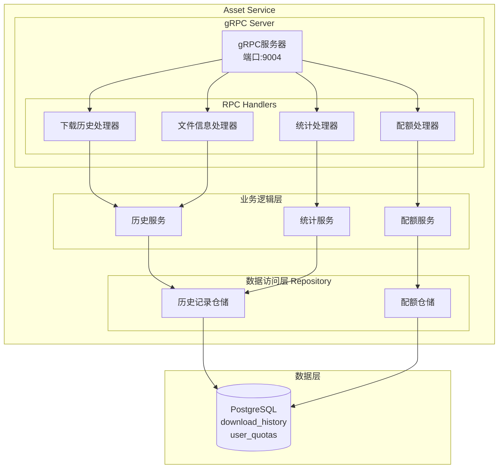
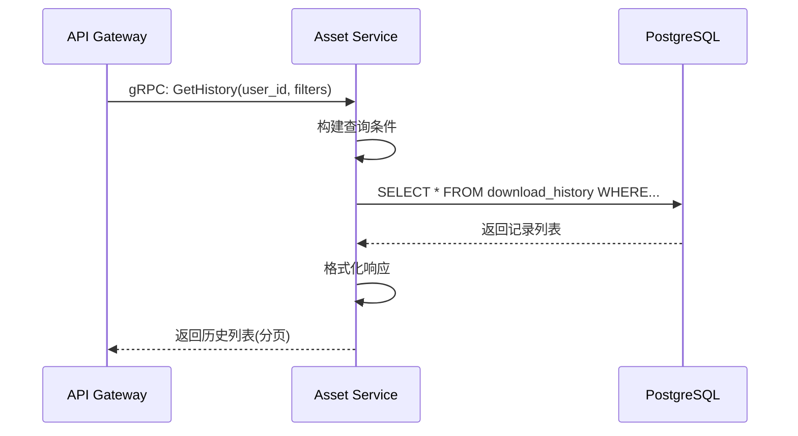
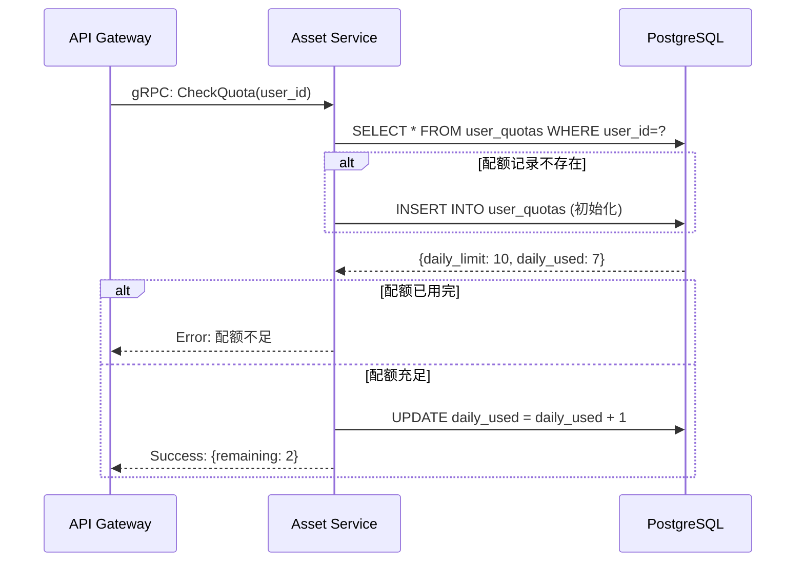

# Asset Service - 详细设计PRD

| 文档属性 | 详细信息 |
|:---|:---:|
| **服务名称** | Asset Service (资产管理服务) |
| **版本** | V1.0.0 |
| **端口** | 9004 (gRPC) |
| **依赖服务** | PostgreSQL |

---

## 1. 服务概述

### 1.1 职责定义
Asset Service负责用户资产和下载历史的管理,核心职责包括:
- **历史管理**: 用户下载历史的CRUD操作
- **配额管理**: 用户每日下载配额的管理和校验
- **数据统计**: 用户使用统计和数据分析
- **文件信息**: 提供文件元数据和访问权限验证

### 1.2 核心特性
- 下载历史查询和过滤
- 用户配额实时管理
- 多维度数据统计
- 文件权限校验

---

## 2. 架构设计

### 2.1 服务架构图



### 2.2 核心流程

#### 查询历史流程


#### 配额校验流程


---

## 3. 功能模块

### 3.1 下载历史管理

#### 历史查询
```go
type HistoryFilter struct {
    UserID    int64
    Status    *int       // 可选:状态过滤
    Platform  *string    // 可选:平台过滤
    StartDate *time.Time // 可选:开始日期
    EndDate   *time.Time // 可选:结束日期
    Page      int
    PageSize  int
    SortBy    string     // created_at, file_size, etc.
    SortOrder string     // asc, desc
}

func (s *HistoryService) GetHistory(ctx context.Context, filter *HistoryFilter) (*HistoryResult, error) {
    query := s.db.Model(&DownloadHistory{}).Where("user_id = ?", filter.UserID)
    
    // 应用过滤条件
    if filter.Status != nil {
        query = query.Where("status = ?", *filter.Status)
    }
    if filter.Platform != nil {
        query = query.Where("platform = ?", *filter.Platform)
    }
    if filter.StartDate != nil {
        query = query.Where("created_at >= ?", *filter.StartDate)
    }
    if filter.EndDate != nil {
        query = query.Where("created_at <= ?", *filter.EndDate)
    }
    
    // 计数
    var total int64
    query.Count(&total)
    
    // 排序和分页
    offset := (filter.Page - 1) * filter.PageSize
    var records []DownloadHistory
    
    query.Order(fmt.Sprintf("%s %s", filter.SortBy, filter.SortOrder)).
        Limit(filter.PageSize).
        Offset(offset).
        Find(&records)
    
    return &HistoryResult{
        Total:    total,
        Page:     filter.Page,
        PageSize: filter.PageSize,
        Items:    records,
    }, nil
}
```

#### 删除历史记录
```go
func (s *HistoryService) DeleteHistory(ctx context.Context, historyID, userID int64) error {
    // 1. 查询记录
    var record DownloadHistory
    if err := s.db.Where("id = ? AND user_id = ?", historyID, userID).First(&record).Error; err != nil {
        return errors.New("record not found")
    }
    
    // 2. 如果文件存在,删除物理文件
    if record.FilePath != "" && record.Status == StatusCompleted {
        if err := os.Remove(record.FilePath); err != nil {
            logger.Warn("failed to delete file", zap.Error(err))
        }
    }
    
    // 3. 删除数据库记录
    return s.db.Delete(&record).Error
}
```

### 3.2 配额管理

#### 用户配额模型
```go
type UserQuota struct {
    ID         int64     `gorm:"primaryKey"`
    UserID     int64     `gorm:"uniqueIndex"`
    DailyLimit int       `gorm:"not null"` // 每日下载限制
    DailyUsed  int       `gorm:"not null"` // 今日已用
    ResetAt    time.Time `gorm:"not null"` // 配额重置时间
    UpdatedAt  time.Time
}
```

#### 配额校验
```go
func (s *QuotaService) CheckQuota(ctx context.Context, userID int64) error {
    quota, err := s.getOrCreateQuota(userID)
    if err != nil {
        return err
    }
    
    // 检查是否需要重置
    now := time.Now()
    if now.After(quota.ResetAt) {
        quota.DailyUsed = 0
        quota.ResetAt = getNextMidnight(now)
        s.repo.Update(ctx, quota)
    }
    
    // 检查配额
    if quota.DailyUsed >= quota.DailyLimit {
        return errors.New("daily quota exceeded")
    }
    
    return nil
}

func (s *QuotaService) ConsumeQuota(ctx context.Context, userID int64) error {
    return s.db.Model(&UserQuota{}).
        Where("user_id = ?", userID).
        Update("daily_used", gorm.Expr("daily_used + 1")).
        Error
}

func getNextMidnight(t time.Time) time.Time {
    year, month, day := t.Add(24 * time.Hour).Date()
    return time.Date(year, month, day, 0, 0, 0, 0, t.Location())
}
```

#### 配额初始化
```go
func (s *QuotaService) getOrCreateQuota(userID int64) (*UserQuota, error) {
    var quota UserQuota
    err := s.db.Where("user_id = ?", userID).First(&quota).Error
    
    if err == gorm.ErrRecordNotFound {
        // 创建默认配额
        quota = UserQuota{
            UserID:     userID,
            DailyLimit: 10, // 默认每日10次
            DailyUsed:  0,
            ResetAt:    getNextMidnight(time.Now()),
        }
        s.db.Create(&quota)
        return &quota, nil
    }
    
    return &quota, err
}
```

### 3.3 数据统计

#### 统计维度
```go
type UserStats struct {
    TotalDownloads     int64   `json:"total_downloads"`
    SuccessDownloads   int64   `json:"success_downloads"`
    FailedDownloads    int64   `json:"failed_downloads"`
    TotalSize          int64   `json:"total_size_bytes"`
    TotalDuration      int64   `json:"total_duration_seconds"`
    TopPlatforms       []PlatformStat `json:"top_platforms"`
    RecentActivity     []DailyActivity `json:"recent_activity"`
}

type PlatformStat struct {
    Platform string `json:"platform"`
    Count    int64  `json:"count"`
}

type DailyActivity struct {
    Date  string `json:"date"`
    Count int64  `json:"count"`
}
```

#### 统计查询
```go
func (s *StatsService) GetUserStats(ctx context.Context, userID int64) (*UserStats, error) {
    stats := &UserStats{}
    
    // 总下载数
    s.db.Model(&DownloadHistory{}).
        Where("user_id = ?", userID).
        Count(&stats.TotalDownloads)
    
    // 成功下载数
    s.db.Model(&DownloadHistory{}).
        Where("user_id = ? AND status = ?", userID, StatusCompleted).
        Count(&stats.SuccessDownloads)
    
    // 失败下载数
    s.db.Model(&DownloadHistory{}).
        Where("user_id = ? AND status = ?", userID, StatusFailed).
        Count(&stats.FailedDownloads)
    
    // 总文件大小
    s.db.Model(&DownloadHistory{}).
        Where("user_id = ? AND status = ?", userID, StatusCompleted).
        Select("COALESCE(SUM(file_size), 0)").
        Scan(&stats.TotalSize)
    
    // 按平台统计
    s.db.Model(&DownloadHistory{}).
        Select("platform, COUNT(*) as count").
        Where("user_id = ?", userID).
        Group("platform").
        Order("count DESC").
        Limit(5).
        Scan(&stats.TopPlatforms)
    
    // 最近30天活动
    thirtyDaysAgo := time.Now().AddDate(0, 0, -30)
    s.db.Model(&DownloadHistory{}).
        Select("DATE(created_at) as date, COUNT(*) as count").
        Where("user_id = ? AND created_at >= ?", userID, thirtyDaysAgo).
        Group("DATE(created_at)").
        Order("date DESC").
        Scan(&stats.RecentActivity)
    
    return stats, nil
}
```

### 3.4 文件信息服务

#### 文件权限验证
```go
func (s *HistoryService) GetFileInfo(ctx context.Context, historyID, userID int64) (*FileInfo, error) {
    var record DownloadHistory
    err := s.db.Where("id = ? AND user_id = ?", historyID, userID).First(&record).Error
    
    if err != nil {
        if err == gorm.ErrRecordNotFound {
            return nil, status.Error(codes.PermissionDenied, "access denied")
        }
        return nil, err
    }
    
    // 检查文件是否存在
    if _, err := os.Stat(record.FilePath); os.IsNotExist(err) {
        return nil, status.Error(codes.NotFound, "file not found")
    }
    
    return &FileInfo{
        FilePath: record.FilePath,
        FileName: record.FileName,
        FileSize: record.FileSize,
        FileHash: record.FileHash,
    }, nil
}
```

---

## 4. 数据库设计

### 4.1 User_Quotas表

```sql
CREATE TABLE user_quotas (
    id          BIGSERIAL PRIMARY KEY,
    user_id     BIGINT NOT NULL UNIQUE,
    daily_limit INT NOT NULL DEFAULT 10,
    daily_used  INT NOT NULL DEFAULT 0,
    reset_at    TIMESTAMP NOT NULL,
    updated_at  TIMESTAMP NOT NULL DEFAULT CURRENT_TIMESTAMP,
    
    FOREIGN KEY (user_id) REFERENCES users(id) ON DELETE CASCADE,
    INDEX idx_user_id (user_id),
    INDEX idx_reset_at (reset_at)
);
```

#### 字段说明
| 字段 | 类型 | 说明 |
|:---|:---|:---|
| `id` | BIGSERIAL | 主键 |
| `user_id` | BIGINT | 用户ID,唯一索引 |
| `daily_limit` | INT | 每日下载限制(默认10) |
| `daily_used` | INT | 今日已使用次数 |
| `reset_at` | TIMESTAMP | 配额重置时间(通常是次日0点) |
| `updated_at` | TIMESTAMP | 最后更新时间 |

### 4.2 查询优化

#### 复合索引
```sql
-- 历史查询索引(用户+状态+时间)
CREATE INDEX idx_history_user_status_time 
ON download_history(user_id, status, created_at DESC);

-- 统计查询索引
CREATE INDEX idx_history_user_platform 
ON download_history(user_id, platform);

-- 时间范围查询
CREATE INDEX idx_history_created_at 
ON download_history(created_at);
```

#### 分区表(可选,大数据量时)
```sql
-- 按月分区
CREATE TABLE download_history_2025_12 PARTITION OF download_history
FOR VALUES FROM ('2025-12-01') TO ('2026-01-01');

CREATE TABLE download_history_2026_01 PARTITION OF download_history
FOR VALUES FROM ('2026-01-01') TO ('2026-02-01');
```

---

## 5. 接口设计 (gRPC)

### 5.1 Proto定义

```protobuf
syntax = "proto3";

package asset;

option go_package = "vasset/asset/pb";

service AssetService {
  // 获取下载历史
  rpc GetHistory(GetHistoryRequest) returns (GetHistoryResponse);
  
  // 删除历史记录
  rpc DeleteHistory(DeleteHistoryRequest) returns (DeleteHistoryResponse);
  
  // 检查配额
  rpc CheckQuota(CheckQuotaRequest) returns (CheckQuotaResponse);
  
  // 消费配额
  rpc ConsumeQuota(ConsumeQuotaRequest) returns (ConsumeQuotaResponse);
  
  // 获取用户统计
  rpc GetUserStats(GetUserStatsRequest) returns (GetUserStatsResponse);
  
  // 获取文件信息(用于下载)
  rpc GetFileInfo(GetFileInfoRequest) returns (GetFileInfoResponse);
}

// 获取历史请求
message GetHistoryRequest {
  int64 user_id = 1;
  int32 status = 2;        // 可选:状态过滤
  string platform = 3;     // 可选:平台过滤
  string start_date = 4;   // 可选:YYYY-MM-DD
  string end_date = 5;     // 可选:YYYY-MM-DD
  int32 page = 6;
  int32 page_size = 7;
  string sort_by = 8;      // created_at, file_size
  string sort_order = 9;   // asc, desc
}

message GetHistoryResponse {
  int64 total = 1;
  int32 page = 2;
  int32 page_size = 3;
  repeated HistoryItem items = 4;
}

message HistoryItem {
  int64 history_id = 1;
  string task_id = 2;
  string url = 3;
  string platform = 4;
  string title = 5;
  string mode = 6;
  string quality = 7;
  int64 file_size = 8;
  int32 status = 9;
  string created_at = 10;
  string completed_at = 11;
}

// 删除历史请求
message DeleteHistoryRequest {
  int64 history_id = 1;
  int64 user_id = 2;
}

message DeleteHistoryResponse {
  bool success = 1;
}

// 检查配额请求
message CheckQuotaRequest {
  int64 user_id = 1;
}

message CheckQuotaResponse {
  int32 daily_limit = 1;
  int32 daily_used = 2;
  int32 remaining = 3;
  string reset_at = 4;
}

// 消费配额请求
message ConsumeQuotaRequest {
  int64 user_id = 1;
}

message ConsumeQuotaResponse {
  bool success = 1;
  int32 remaining = 2;
}

// 获取统计请求
message GetUserStatsRequest {
  int64 user_id = 1;
}

message GetUserStatsResponse {
  int64 total_downloads = 1;
  int64 success_downloads = 2;
  int64 failed_downloads = 3;
  int64 total_size_bytes = 4;
  repeated PlatformStat top_platforms = 5;
  repeated DailyActivity recent_activity = 6;
}

message PlatformStat {
  string platform = 1;
  int64 count = 2;
}

message DailyActivity {
  string date = 1;
  int64 count = 2;
}

// 获取文件信息请求
message GetFileInfoRequest {
  int64 history_id = 1;
  int64 user_id = 2;
}

message GetFileInfoResponse {
  string file_path = 1;
  string file_name = 2;
  int64 file_size = 3;
  string file_hash = 4;
}
```

---

## 6. 配置管理

### 6.1 配置文件 (config/dev.yaml)
```yaml
server:
  port: 9004

database:
  host: localhost
  port: 5432
  user: vasset
  password: password
  dbname: vasset
  max_open_conns: 50
  max_idle_conns: 10
  
quota:
  default_daily_limit: 10       # 普通用户每日限制
  vip_daily_limit: 100          # VIP用户每日限制
  reset_hour: 0                 # 每日重置时间(0点)
  
pagination:
  default_page_size: 20
  max_page_size: 100
  
cache:
  quota_ttl: 300                # 配额缓存5分钟
```

---

## 7. 非功能性需求

### 7.1 性能指标
- **历史查询(P95)**: < 100ms
- **配额校验(P95)**: < 50ms
- **统计查询(P95)**: < 200ms
- **并发处理**: 500+ QPS

### 7.2 数据一致性
- **配额并发**: 使用数据库行锁防止并发问题
- **历史删除**: 软删除或标记,保留审计日志

```go
// 并发安全的配额消费
func (s *QuotaService) ConsumeQuotaSafe(ctx context.Context, userID int64) error {
    tx := s.db.Begin()
    defer func() {
        if r := recover(); r != nil {
            tx.Rollback()
        }
    }()
    
    // 行锁
    var quota UserQuota
    if err := tx.Set("gorm:query_option", "FOR UPDATE").
        Where("user_id = ?", userID).
        First(&quota).Error; err != nil {
        tx.Rollback()
        return err
    }
    
    // 检查配额
    if quota.DailyUsed >= quota.DailyLimit {
        tx.Rollback()
        return errors.New("quota exceeded")
    }
    
    // 递增
    quota.DailyUsed++
    if err := tx.Save(&quota).Error; err != nil {
        tx.Rollback()
        return err
    }
    
    return tx.Commit().Error
}
```

### 7.3 缓存策略(可选)
```go
// 配额缓存
type QuotaCache struct {
    redis *redis.Client
}

func (c *QuotaCache) Get(userID int64) (*UserQuota, error) {
    key := fmt.Sprintf("quota:%d", userID)
    data, err := c.redis.Get(context.Background(), key).Bytes()
    
    if err == redis.Nil {
        return nil, errors.New("cache miss")
    }
    
    var quota UserQuota
    json.Unmarshal(data, &quota)
    return &quota, nil
}

func (c *QuotaCache) Set(quota *UserQuota) error {
    key := fmt.Sprintf("quota:%d", quota.UserID)
    data, _ := json.Marshal(quota)
    return c.redis.Set(context.Background(), key, data, 5*time.Minute).Err()
}
```

---

## 8. 监控与告警

### 8.1 监控指标
```yaml
metrics:
  business:
    - asset_history_queries_total
    - asset_quota_checks_total
    - asset_quota_exceeded_total
    - asset_stats_queries_total
    
  performance:
    - asset_grpc_duration_seconds (P50/P95/P99)
    - asset_db_query_duration_seconds
```

### 8.2 告警规则
| 告警项 | 阈值 | 级别 |
|:---|:---|:---|
| 查询失败率 | > 5% | P2 |
| 平均查询延迟 | > 200ms | P3 |
| 数据库连接池耗尽 | 可用 < 5 | P1 |

---

## 9. 部署与运维

### 9.1 健康检查
```go
func (s *AssetService) HealthCheck(ctx context.Context, req *pb.HealthCheckRequest) (*pb.HealthCheckResponse, error) {
    if err := s.db.Ping(); err != nil {
        return &pb.HealthCheckResponse{Status: "unhealthy"}, nil
    }
    return &pb.HealthCheckResponse{Status: "healthy"}, nil
}
```

### 9.2 数据备份
- **频率**: 每日全量备份
- **保留期**: 30天
- **备份验证**: 每周恢复测试

---

**功能总结**: Asset Service提供了用户资产管理的完整功能,包括历史查询、配额控制和数据统计,是用户体验的重要组成部分。
