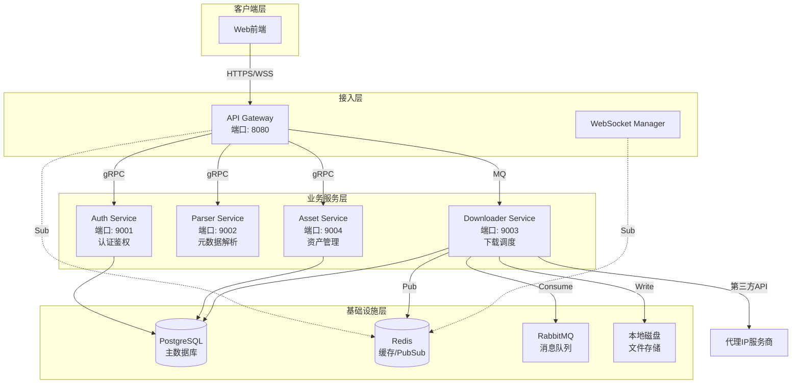

# V-Asset 后端PRD文档索引

> **文档版本**: V1.1.0  
> **最后更新**: 2025-12-03  
> **技术栈**: Go (Gin/gRPC), PostgreSQL, Redis, RabbitMQ

---

## 📋 文档导航

### 总体架构文档
- [**00_总体架构PRD.md**](./00_总体架构PRD.md) - 系统整体架构、基础设施和跨服务设计

### 微服务PRD文档

| 序号 | 服务名称 | 文档 | 核心职责 |
|:---:|:---|:---|:---|
| 1 | API Gateway | [01_APIGateway服务PRD.md](./01_APIGateway服务PRD.md) | 统一接入层、路由转发、认证鉴权、WebSocket管理 |
| 2 | Auth Service | [02_Auth服务PRD.md](./02_Auth服务PRD.md) | 用户认证、JWT管理、权限验证 |
| 3 | Parser Service | [03_Parser服务PRD.md](./03_Parser服务PRD.md) | URL解析、元数据提取、多平台适配 |
| 4 | Downloader Service | [04_Downloader服务PRD.md](./04_Downloader服务PRD.md) | 视频下载、代理管理、文件存储、任务调度 ⭐核心 |
| 5 | Asset Service | [05_Asset服务PRD.md](./05_Asset服务PRD.md) | 下载历史、用户配额、数据统计 |

---

## 🏗️ 系统架构概览

---

## 🔧 技术栈总览

### 核心技术
- **开发语言**: Go 1.21+
- **Web框架**: Gin (HTTP), gRPC (微服务通信)
- **数据库**: PostgreSQL 14+
- **缓存**: Redis 7+
- **消息队列**: RabbitMQ 3.12+
- **下载引擎**: yt-dlp

### 开发工具
- **依赖管理**: Go Modules
- **数据库迁移**: golang-migrate
- **API文档**: Swagger/OpenAPI 3.0
- **日志**: zap
- **配置管理**: viper

---

## 📊 服务通信协议

| 通信场景 | 协议 | 说明 |
|:---|:---|:---|
| 前端 ↔ Gateway | HTTP/HTTPS, WebSocket | RESTful API + 实时推送 |
| Gateway ↔ 业务服务 | gRPC | 高性能RPC调用 |
| Gateway → Downloader | RabbitMQ | 异步任务分发 |
| Downloader → 前端 | Redis PubSub | 下载进度推送 |

---

## 📦 数据库表归属

| 表名 | 归属服务 | 用途 |
|:---|:---|:---|
| `users` | Auth Service | 用户账号信息 |
| `user_sessions` | Auth Service | 用户会话管理 |
| `download_history` | Asset + Downloader | 下载历史记录(共享) |
| `user_quotas` | Asset Service | 用户配额管理 |

---

## 🚀 部署架构

### MVP阶段部署方案
- **部署方式**: Docker Compose
- **服务实例**: 每个服务单实例
- **存储**: 本地磁盘挂载 (`/data/vasset/`)
- **高可用**: 暂不实现,后续通过K8s扩展

### 生产环境规划
- **容器编排**: Kubernetes
- **服务网格**: Istio (可选)
- **对象存储**: 迁移至S3兼容存储
- **负载均衡**: Nginx Ingress

---

## 📝 非功能性需求概览

### 性能指标
- **API响应时间**: P95 < 200ms
- **并发下载数**: 支持50个并发下载任务
- **文件传输速度**: 受限于网络带宽

### 安全要求
- **认证**: JWT Token,有效期24小时
- **传输加密**: 全站HTTPS
- **密码存储**: bcrypt加密
- **文件访问控制**: 基于用户权限验证

### 可用性
- **服务可用性**: 99% (MVP阶段)
- **数据持久化**: PostgreSQL主从备份
- **日志保留**: 30天

---

## 📖 版本历史

| 版本 | 日期 | 变更说明 |
|:---|:---|:---|
| V1.1.0 | 2025-12-03 | 拆分微服务PRD文档,完善架构设计 |
| V1.0.0 | 2025-12-02 | 初始版本,MVP架构设计 |

---

## 👥 文档维护

如需更新文档,请遵循以下规则:
1. 跨服务的架构变更需同步更新总体架构PRD
2. 接口变更需同步更新调用方和提供方的PRD
3. 数据库表结构变更需同步更新相关服务PRD
4. 重大变更需更新版本历史

---

**下一步**: 请根据您的需求选择对应的服务PRD文档查看详细设计。
