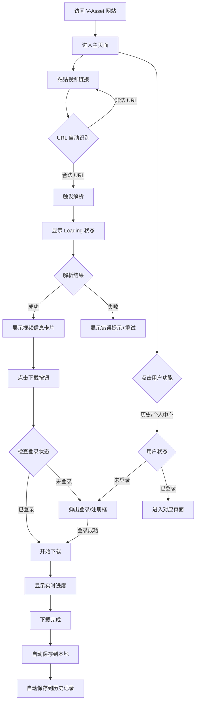

# 视频资产中台 (V-Asset) - 产品需求文档 (PRD)

## 文档信息

| 属性 | 信息 |
|:---|:---|
| **产品名称** | V-Asset (视频资产中台) |
| **文档版本** | V1.0.0 |
| **发布阶段** | MVP |
| **文档类型** | 前端功能需求文档 |
| **创建日期** | 2025-12-01 |
| **最后更新** | 2025-12-01 |

---

## 1. 产品概述

### 1.1 产品定位

V-Asset 是一款基于动态 IP 池的企业级视频下载工具,通过极简的 Web 界面为用户提供 **100% 成功率、零广告、高颜值** 的视频获取服务。

### 1.2 目标用户

- **主要用户**:需要快速下载视频或音频资源的个人用户
- **使用场景**:日常视频/音频素材获取、学习资料保存、内容创作准备

### 1.3 核心价值主张

1. **稳定性保障**:利用动态 IP 池技术,解决平台反爬封锁问题
2. **沉浸体验**: 默认进入主页即可解析,无需繁琐跳转
3. **极简流程**: 简洁的界面,下载时自动引导登录/注册
4. **高成功率**: 智能重试机制,确保下载成功
5. **炫彩视觉**: 现代化的流光与渐变特效,提供愉悦的视觉体验
6. **历史记录**: 自动保存下载历史,方便管理和重新获取

### 1.4 MVP 范围界定

#### 包含功能
- 用户注册/登录系统 ✨
- URL 自动解析与视频信息展示
- 视频/音频下载功能
- 实时进度展示
- 下载历史记录 ✨
- 用户额度管理系统

#### 暂不包含
- 多任务并行下载
- 视频转码或编辑
- 支付系统
- 分享裂变机制
- 企业API接口

---

## 2. 用户流程设计

### 2.1 核心用户旅程



### 2.2 异常流程处理

| 异常场景 | 用户感知 | 系统处理 |
|:---|:---|:---|
| 未登录访问 | 自动跳转到登录页面 | 拦截所有未认证请求 |
| 解析失败 | 友好提示"目标暂不可达,正在切换节点重试" | 后端自动切换 IP 重试(最多3次) |
| 用户额度用尽 | 显示提示 + 引导升级套餐 | 基于用户ID识别,阻止下载请求 |
| 资源过大(>2GB) | 前端提示"资源过大,暂不支持" | 拒绝下载请求,释放资源 |
| 网络中断 | 进度条暂停 + 重连提示 | 自动重试连接 |
| Token过期 | 自动刷新或引导重新登录 | 检测Token有效性 |
| 邮箱已注册 | 提示"邮箱已存在,请直接登录" | 拒绝注册请求 |
| 验证码错误 | 提示"验证码错误,请重新输入" | 允许重试3次 |

---

## 3. 页面架构与详细布局
 
 ### 3.1 站点地图 (Site Map)
 
 ```mermaid
 graph TD
     Home[P1 首页/工具页]
     Auth[P2 认证弹窗]
     User[用户中心]
     
     Home --> Auth
     Home --> User
     
     subgraph UserCenter [用户中心模块]
         Profile[P3 个人资料]
         History[P4 下载历史]
         Stats[P5 使用统计]
     end
     
     User --> Profile
     User --> History
     User --> Stats
 ```
 
 ### 3.2 核心页面布局详解
 
 #### P1 - 首页 (Landing & Tool)
 **定位**: 核心功能承载页，极致简洁，视觉冲击力强。
 
 **布局结构**:
 ```
 ┌─────────────────────────────────────────────────────────────┐
 │  [Header] Logo (左)                    [登录/注册] (右)    │
 │  (透明背景, 磨砂玻璃效果)                                     │
 ├─────────────────────────────────────────────────────────────┤
 │                                                             │
 │           (背景: 动态 Mesh Gradient 炫彩光晕)                │
 │           (色彩: 蓝/紫/粉 柔和渐变流动)                       │
 │                                                             │
 │  ┌───────────────────────────────────────────────────────┐  │
 │  │  [Hero Title]                                         │  │
 │  │  "释放视频的力量" (大号加粗字体, 渐变色填充)             │  │
 │  │                                                       │  │
 │  │  [F1 输入框组件]                                       │  │
 │  │  (白色背景, 深度阴影, 聚焦时流光边框)                    │  │
 │  │  [ 粘贴链接...                                     ]  │  │
 │  └───────────────────────────────────────────────────────┘  │
 │                                                             │
 │  ┌───────────────────────────────────────────────────────┐  │
 │  │  [F2 结果卡片 & F4 进度条] (解析后出现)                 │  │
 │  │  (从下方弹入, 悬浮感卡片设计)                           │  │
 │  └───────────────────────────────────────────────────────┘  │
 │                                                             │
 │  [Footer] 版权信息 | 使用条款 (底部居中, 弱化显示)           │
 │                                                             │
 └─────────────────────────────────────────────────────────────┘
 ```
 
 #### P2 - 认证弹窗 (Auth Modal)
 **定位**: 阻断式操作，聚焦完成登录/注册。
 
 **布局结构**:
 ```
 ┌────────────────────────────────────────┐
 │  [Logo] V-Asset                        │
 │  (居中显示)                             │
 ├────────────────────────────────────────┤
 │  [Tabs] 登录 | 注册                     │
 │  (下划线跟随动画)                        │
 ├────────────────────────────────────────┤
 │                                        │
 │  [Input] 邮箱                           │
 │  [Input] 密码                           │
 │                                        │
 │  [Button] 登录/注册 (全宽, 品牌色)       │
 │                                        │
 │  ─────── 或 ───────                     │
 │                                        │
 │  [Grid] 第三方登录图标 (Google/GitHub)   │
 │                                        │
 └────────────────────────────────────────┘
 ```
 
 #### P3 - 个人中心 (User Profile)
 **定位**: 管理个人信息与设置。
 
 **布局结构**:
 ```
 ┌─────────────────────────────────────────────────────────────┐
 │  [Header]                                                   │
 ├──────────────────────┬──────────────────────────────────────┤
 │  [Sidebar]           │  [Main Content]                      │
 │                      │                                      │
 │  ● 个人资料 (Active)  │  [Card] 基本信息                      │
 │  ○ 下载历史           │  [Avatar] [Upload]                   │
 │  ○ 使用统计           │  昵称: [Input]                       │
 │  ○ 退出登录           │  邮箱: user@...                      │
 │                      │                                      │
 │                      │  [Card] 账号安全                      │
 │                      │  修改密码...                          │
 │                      │                                      │
 └──────────────────────┴──────────────────────────────────────┘
 ```
 
 #### P4 - 下载历史 (History)
 **定位**: 浏览和管理历史资源。
 
 **布局结构**:
 ```
 ┌─────────────────────────────────────────────────────────────┐
 │  [Header]                                                   │
 ├──────────────────────┬──────────────────────────────────────┤
 │  [Sidebar]           │  [Main Content]                      │
 │                      │                                      │
 │  ○ 个人资料           │  [Toolbar]                           │
 │  ● 下载历史 (Active)  │  [Filter: 全部/视频] [Search Input]  │
 │  ○ 使用统计           │                                      │
 │                      │  [List/Grid]                         │
 │                      │  ┌────────────────────────────────┐  │
 │                      │  │ [Cover] Title           [Btn]  │  │
 │                      │  ├────────────────────────────────┤  │
 │                      │  │ [Cover] Title           [Btn]  │  │
 │                      │  └────────────────────────────────┘  │
 │                      │                                      │
 │                      │  [Pagination]  < 1 2 3 >             │
 └──────────────────────┴──────────────────────────────────────┘
 ```
 
 ---
 
 ## 4. 功能需求详解
 
 ### 4.1 核心交互组件规格

#### F1 - 极简输入区

**功能描述**
提供一个大尺寸、高识别度的 URL 输入框,支持快捷粘贴和自动解析。

**交互规格**

| 交互元素 | 规格说明 |
|:---|:---|
| **输入框尺寸** | 宽度: 600px,高度: 60px |
| **位置定位** | 页面垂直居中,距离顶部 35vh |
| **占位符文案** | "粘贴视频链接,即刻下载..." |
| **快捷键支持** | `Cmd/Ctrl + V` 自动聚焦输入框 |
| **自动解析触发** | 检测到完整 URL 格式后延迟 300ms 自动触发 |

**状态设计**

| 状态 | 视觉表现 | 说明 |
|:---|:---|:---|
| **默认态** | 灰色边框,白色背景 | 等待用户输入 |
| **聚焦态** | 蓝色边框高亮,轻微放大(scale: 1.02) | 用户点击输入 |
| **解析中** | 边缘流光效果,输入框不可编辑 | 系统正在解析 URL |
| **错误态** | 红色边框抖动,显示错误图标 | URL 格式错误或解析失败 |
| **禁用态** | 半透明,锁定图标 | 次数用尽时 |

**技术要点**
- 使用 **Framer Motion** 实现流光边框动画
- URL 格式验证:支持主流平台(YouTube、Bilibili、TikTok 等)
- Debounce 处理:防止用户输入过程中频繁触发解析

---

#### F2 - 结果预览卡片

**功能描述**
解析成功后,展示视频的关键信息,帮助用户确认下载内容。

**卡片布局**

```
┌────────────────────────────────────────┐
│  [封面图]  │  标题: XXX视频          │
│  (16:9)   │  时长: 05:32            │
│  200x112  │  来源: [YouTube图标]     │
│           │  [Download Video]       │
│           │  [Download Audio]       │
└────────────────────────────────────────┘
```

**信息展示规格**

| 信息项 | 数据源 | 展示规则 |
|:---|:---|:---|
| **封面图** | 视频缩略图 URL | 左侧固定尺寸 200x112px,圆角 8px |
| **标题** | 视频原始标题 | 最多显示 2 行,超出显示省略号 |
| **时长** | 视频总时长 | 格式: HH:MM:SS (小于1小时不显示小时) |
| **来源平台** | 平台识别 | 显示对应平台 Logo (24x24px) |

**动画效果**
- 卡片展开:从上方淡入 + 向下滑动 (300ms ease-out)
- 封面加载:骨架屏占位 → 图片淡入

**错误处理**
- 若解析失败,卡片区域显示:
  - Icon: 警告图标
  - 文案: "目标暂不可达,正在切换节点重试..."
  - 操作: 自动重试 3 次,失败后显示 "重新解析" 按钮

---

#### F3 - 操作按钮组

**功能描述**
提供 "下载视频" 和 "下载音频" 两个操作选项。

**按钮规格**

| 按钮类型 | 文案 | 样式 | 行为 |
|:---|:---|:---|:---|
| **主按钮** | Download Video | 蓝色渐变背景,白色文字 | 下载最高画质视频+音频 |
| **次按钮** | Download Audio | 白色背景,灰色边框 | 仅下载音频流 |

**交互细节**
- Hover 状态:轻微放大 (scale: 1.05) + 阴影加深
- Click 状态:按下效果 (scale: 0.98)
- Loading 状态:按钮内显示 Spinner + 文案变为 "准备中..."

**技术实现**
- 使用 `<button>` 原生元素,确保可访问性
- 防重复点击:点击后 1 秒内禁用按钮

---

#### F4 - 沉浸式进度条

**功能描述**
下载开始后,实时展示下载进度、速度和预估剩余时间。

**进度条设计**

```
┌────────────────────────────────────────────┐
│  下载中...                                 │
│  ■■■■■■■■■■□□□□□□□□□□  45%              │
│  速度: 2.5 MB/s  |  剩余时间: 约 30 秒     │
└────────────────────────────────────────────┘
```

**数据展示规格**

| 数据项 | 更新频率 | 格式 |
|:---|:---|:---|
| **百分比** | 每秒更新 | 整数百分比 (0-100%) |
| **下载速度** | 每秒更新 | MB/s 或 KB/s,保留 1 位小数 |
| **剩余时间** | 每 2 秒更新 | "约 X 秒" 或 "约 X 分钟" |

**视觉表现**
- 进度条颜色:蓝色渐变 (与品牌色一致)
- 动画效果:进度条填充使用平滑过渡 (transition: 0.3s)
- 脉动效果:下载时进度条有轻微光晕流动

**技术要点**
- WebSocket 实时推送进度数据
- 前端使用 `requestAnimationFrame` 平滑更新进度条
- 防止进度条倒退:仅允许递增更新

---

#### F5 - 结果交付

**功能描述**
下载完成后,自动触发文件保存,并提供临时链接复制功能。

**交付方式**

| 交付形式 | 实现方式 | 用户体验 |
|:---|:---|:---|
| **自动下载** | 浏览器原生下载 API | 进度 100% 后自动弹出保存对话框 |
| **复制链接** | 临时下载链接 (1小时有效) | 点击 "Copy Link" 按钮复制到剪贴板 |

**完成态界面**

```
┌────────────────────────────────────────────┐
│  ✅ 下载完成!                              │
│  文件已保存到本地                           │
│  [Copy Link]  [下载更多]                   │
└────────────────────────────────────────────┘
```

**操作按钮**
- **Copy Link**:复制临时链接,显示 Toast 提示 "链接已复制"
- **下载更多**:重置页面状态,返回输入框

**临时链接规则**
- 格式: `https://v-asset.com/download/{task_id}/{filename}`
- 有效期: 1 小时
- 访问限制: 不限次数 (有效期内)

---

#### F6 - 用户额度展示

**功能描述**
在页面右上角显示已登录用户的剩余下载次数,引导合理使用。

**展示规格**

| 元素 | 样式 | 位置 |
|:---|:---|:---|
| **计数器组件** | 胶囊状,深色背景 | 页面右上角,距离边缘 24px |
| **文案** | "剩余次数: X" | 白色文字,14px |
| **图标** | 钻石 💎 | 文案左侧,强化 "额度" 概念 |

**状态变化**

| 剩余次数 | 颜色 | 说明 |
|:---|:---|:---|
| **20-11 次** | 蓝色 | 充足状态 |
| **10-5 次** | 绿色 | 普通状态 |
| **4-1 次** | 橙色 | 警告状态,提示用户注意 |
| **0 次** | 红色 | 耗尽状态,显示锁定图标 |

**交互细节**
- Hover 显示 Tooltip: "每日免费 20 次,明日 00:00 重置"
- 每次下载成功后,数字以动画形式递减
- 额度为 0 时,显示"升级套餐"按钮(未来功能)

---

#### F7 - 额度耗尽提示

**功能描述**
当用户当日额度用尽时,锁定输入功能并显示明确提示。

**锁定状态界面**

```
┌─────────────────────────────────────────┐
│  🔒 今日额度已耗尽                      │
│  每日免费 20 次,明日 00:00 重置       │
│  (倒计时: XX 小时)                     │
│                                         │
│  [升级套餐获取更多]  (未来功能)      │
└─────────────────────────────────────────┘
```

**视觉表现**
- 输入框变为半透明灰色,不可点击
- 操作按钮全部禁用
- 页面中央显示锁定卡片

**文案设计**
- 主标题: "今日额度已耗尽"
- 副标题: "每日免费 20 次,明日 00:00 重置"
- 重置时间: 显示倒计时 "XX 小时后重置"

**技术实现**
- 额度识别: 基于用户 ID
- 存储方式: 后端 Redis 缓存,Key: `quota:{user_id}:{date}`
- 重置逻辑: 每日 00:00 (UTC+8) 自动清空

---

#### F8 - 用户注册/登录系统

**功能描述**
提供邮箱注册/登录和第三方OAuth登录方式,降低用户使用门槛。

**界面设计 - 登录弹窗**

```
┌────────────────────────────────────────┐
│              V-Asset                   │
│          [关闭按钮]                     │
├────────────────────────────────────────┤
│                                        │
│  [登录]  |  注册                       │
│                                        │
│  ┌──────────────────────────┐         │
│  │  邮箱                     │         │
│  └──────────────────────────┘         │
│                                        │
│  ┌──────────────────────────┐         │
│  │  密码                     │         │
│  └──────────────────────────┘         │
│                                        │
│  [忘记密码?]                            │
│                                        │
│  ┌──────────────────────────┐         │
│  │     登录                  │         │
│  └──────────────────────────┘         │
│                                        │
│  ─────── 或 ───────                    │
│                                        │
│  [🔵 Google]  [⚫ GitHub]               │
│                                        │
└────────────────────────────────────────┘
```

**登录表单规格**

| 字段 | 验证规则 | 错误提示 |
|:---|:---|:---|
| **邮箱** | 标准邮箱格式 | "请输入有效的邮箱地址" |
| **密码** | 至少6位 | "密码至少6位字符" |

**注册表单规格**

| 字段 | 验证规则 | 错误提示 |
|:---|:---|:---|
| **邮箱** | 标准邮箱格式 + 未被注册 | "邮箱已被注册,请直接登录" |
| **密码** | 至少8位,包含字母+数字 | "密码需包含字母和数字,至少8位" |
| **确认密码** | 与密码一致 | "两次密码输入不一致" |
| **验证码** | 6位数字 | "验证码错误" |

**第三方登录支持**
- **Google OAuth**:主流用户首选
- **GitHub OAuth**:开发者友好

**交互流程**

**邮箱登录:**
1. 用户输入邮箱和密码
2. 点击"登录"按钮
3. 前端验证格式 → 后端验证凭据
4. 成功:关闭弹窗,刷新页面状态
5. 失败:显示错误提示

**邮箱注册:**
1. 切换到"注册"标签
2. 输入邮箱、密码、确认密码
3. 点击"发送验证码"按钮 (60秒倒计时)
4. 输入收到的6位验证码
5. 点击"注册"按钮
6. 成功:自动登录并关闭弹窗
7. 失败:显示错误提示

**第三方登录:**
1. 点击对应平台按钮
2. 跳转到第三方授权页面
3. 用户授权后自动返回
4. 后端创建/绑定账号
5. 自动登录并关闭弹窗

**弹窗规格**

| 属性 | 规格 |
|:---|:---|
| **尺寸** | 宽度 440px,高度自适应 |
| **位置** | 屏幕居中,垂直偏上 (top: 20vh) |
| **背景** | 深色背景 (#1A1A1A),圆角 16px |
| **遮罩** | 半透明黑色 (rgba(0,0,0,0.6)) |
| **动画** | 淡入 + 缩放 (300ms ease-out) |

**状态管理**

| 状态 | 视觉表现 |
|:---|:---|
| **输入中** | 蓝色边框高亮 |
| **验证中** | 按钮显示 Spinner |
| **错误** | 输入框红色边框 + 错误文案 |
| **成功** | Toast 提示"登录成功" |

**技术要点**
- 使用 **React Hook Form** 管理表单状态
- **Yup** 进行表单验证
- JWT Token 存储在 **localStorage**
- 自动刷新 Token 机制 (过期前5分钟)

---

#### F9 - 下载历史记录

**功能描述**
为已登录用户提供下载历史记录查看功能,方便重新获取之前下载的内容。

**入口设计**
- 页面右上角用户头像旁边显示 "历史" 按钮
- 点击后展开侧边栏或跳转到独立页面

**历史记录页面布局**

```
┌────────────────────────────────────────────────┐
│  [← 返回]    下载历史                          │
├────────────────────────────────────────────────┤
│                                                │
│  [全部] [视频] [音频]     🔍 搜索...            │
│                                                │
│  ┌──────────────────────────────────────────┐ │
│  │ [封面] 视频标题XXXXX                      │ │
│  │        来源: YouTube | 时长: 05:32       │ │
│  │        下载时间: 2025-12-01 15:30        │ │
│  │        [重新下载] [复制链接] [删除]        │ │
│  └──────────────────────────────────────────┘ │
│                                                │
│  ┌──────────────────────────────────────────┐ │
│  │ [封面] 另一个视频标题                     │ │
│  │        来源: Bilibili | 时长: 10:45      │ │
│  │        下载时间: 2025-11-30 20:15        │ │
│  │        [重新下载] [复制链接] [删除]        │ │
│  └──────────────────────────────────────────┘ │
│                                                │
│  [加载更多...]                                 │
│                                                │
└────────────────────────────────────────────────┘
```

**功能规格**

| 功能项 | 说明 |
|:---|:---|
| **筛选** | 全部 / 仅视频 / 仅音频 |
| **搜索** | 根据标题关键词搜索 |
| **排序** | 按下载时间倒序 (最新在前) |
| **分页** | 每页显示 20 条,支持滚动加载 |

**历史记录卡片信息**

| 信息项 | 数据源 |
|:---|:---|
| **封面图** | 原视频缩略图 (80x45px) |
| **标题** | 原视频标题 (最多1行) |
| **来源平台** | 平台名称 + Logo |
| **时长** | 视频时长 |
| **下载时间** | 格式: YYYY-MM-DD HH:mm |
| **文件类型** | 视频/音频标签 |

**操作按钮**

| 按钮 | 功能 | 说明 |
|:---|:---|:---|
| **重新下载** | 再次下载该资源 | 如果临时链接未过期,直接使用;否则重新解析下载 |
| **复制链接** | 复制临时下载链接 | 仅在有效期内显示 |
| **删除** | 从历史中移除 | 确认对话框:"确定删除此记录?" |

**空状态设计**

```
┌────────────────────────────────────┐
│         📦                         │
│    暂无下载历史                     │
│    开始你的第一次下载吧!             │
│                                    │
│    [去下载]                         │
└────────────────────────────────────┘
```

**数据存储**
- 后端数据库存储 (PostgreSQL)
- 表结构: `downloads` 表
  - `id`: 主键
  - `user_id`: 用户ID
  - `video_url`: 原视频URL
  - `title`: 视频标题
  - `thumbnail`: 封面图URL
  - `platform`: 来源平台
  - `duration`: 时长(秒)
  - `file_type`: 文件类型 (video/audio)
  - `download_url`: 临时下载链接
  - `expires_at`: 链接过期时间
  - `created_at`: 下载时间

**技术要点**
- 使用虚拟滚动优化长列表性能
- 搜索使用 debounce 防抖 (500ms)
- 删除操作使用乐观更新提升体验

---

#### F10 - 用户中心

**功能描述**
用户登录后,右上角显示用户头像和昵称,点击展开下拉菜单。

**头像组件设计**

```
┌─────────────────────────┐
│ [头像] 用户名    剩余: 20 │
└─────────────────────────┘
```

**下拉菜单**

```
┌──────────────────────┐
│  👤 个人信息         │
│  📊 使用统计         │
│  📝 下载历史         │
│  ⚙️  设置            │
│  ──────────────      │
│  🚪 退出登录         │
└──────────────────────┘
```

**个人信息页面**

```
┌────────────────────────────────────┐
│  个人信息                          │
├────────────────────────────────────┤
│                                    │
│  [头像]                            │
│  [点击修改头像]                    │
│                                    │
│  昵称: [输入框]                    │
│  邮箱: user@example.com (不可修改) │
│                                    │
│  [保存修改]                        │
│                                    │
├────────────────────────────────────┤
│  账号安全                          │
├────────────────────────────────────┤
│                                    │
│  修改密码: [修改]                  │
│  绑定第三方账号:                   │
│    Google: [已绑定] / [绑定]       │
│    GitHub: [已绑定] / [绑定]       │
│                                    │
└────────────────────────────────────┘
```

**使用统计页面**

```
┌────────────────────────────────────┐
│  使用统计                          │
├────────────────────────────────────┤
│                                    │
│  📊 本月下载次数: 45               │
│  📈 累计下载次数: 328              │
│  💎 当前套餐: 免费版 (每日20次)    │
│  🎯 剩余额度: 15 次                │
│                                    │
│  [升级套餐]                        │
│                                    │
│  ──────────────────────────        │
│                                    │
│  最近7天下载趋势:                  │
│  [简单的柱状图]                    │
│                                    │
└────────────────────────────────────┘
```

**用户额度策略**

| 用户类型 | 每日额度 | 说明 |
|:---|:---|:---|
| **注册用户** | 20次 | 基于用户ID识别 |
| **付费用户** | 不限 | 未来扩展 |

**退出登录流程**
1. 点击"退出登录"
2. 确认对话框:"确定要退出吗?"
3. 清除本地 Token
4. 刷新页面,返回访客状态

**技术要点**
- 用户头像支持上传到 CDN
- 使用 **React Context** 管理全局用户状态
- 退出登录前调用 `/api/logout` 接口使 Token 失效

---

## 5. 界面设计规范

### 4.1 设计原则

1. **极简至上**: 单一焦点,减少视觉噪音
2. **炫彩灵动**: 引入 **Mesh Gradients (弥散光感)** 和 **多彩流光**, 营造年轻、活力的氛围
3. **明亮通透**: **默认浅色模式**, 打造清爽、专业的工具感
4. **流畅动效**: 微交互增强沉浸感, 操作反馈加入炫彩特效 (如成功时的彩带/光效)

### 4.2 视觉风格参考

- **Linear**:简洁的输入框设计和微妙的阴影
- **Vercel**:流光边框和渐变按钮
- **Raycast**:现代化的卡片布局和图标系统
- **shadcn/ui**: 作为基础组件库,提供极简、可定制的组件原语

### 4.3 色彩系统

| 用途 | 颜色值 | 说明 |
|:---|:---|:---|
| **主色调** | `#0070F3` | 品牌蓝,用于主按钮、强调文字 |
| **背景色** | `#FFFFFF` | 页面主背景 (浅色模式) |
| **卡片背景** | `#FFFFFF` | 卡片背景,配合阴影 `shadow-lg` |
| **装饰色** | `Gradient` | 蓝紫渐变/炫彩光晕,用于背景装饰和边框流光 |
| **文字主色** | `#000000` | 主要文字 |
| **文字辅助** | `#666666` | 次要信息 |
| **边框色** | `#E5E7EB` | 浅灰边框 |
| **成功色** | `#10B981` | 完成状态 |
| **警告色** | `#F59E0B` | 额度不足 |
| **错误色** | `#EF4444` | 错误提示 |

### 4.4 字体系统

| 层级 | 字号 | 字重 | 使用场景 |
|:---|:---|:---|:---|
| **H1** | 48px | Bold | 页面大标题 (如有) |
| **H2** | 32px | SemiBold | 卡片标题 |
| **Body** | 16px | Regular | 正文内容 |
| **Caption** | 14px | Regular | 辅助信息 |
| **Small** | 12px | Regular | 提示文字 |

**字体族**
- 西文: `Inter`, `-apple-system`, `sans-serif`
- 中文: `PingFang SC`, `Microsoft YaHei`

### 4.5 间距系统

遵循 **8px 网格系统**:
- 微间距: 8px
- 小间距: 16px
- 中间距: 24px
- 大间距: 32px
- 超大间距: 48px

### 4.6 圆角规范

- 输入框: 12px
- 按钮: 8px
- 卡片: 16px
- 小图标: 4px

---

## 6. 交互规范

### 5.1 动画时长标准

| 动画类型 | 时长 | 缓动函数 |
|:---|:---|:---|
| **快速反馈** | 150ms | ease-out |
| **标准过渡** | 300ms | ease-in-out |
| **大型变化** | 500ms | cubic-bezier(0.4, 0, 0.2, 1) |

### 5.2 Loading 状态设计

**全局 Loading**
- 首次页面加载:骨架屏
- 数据请求:局部 Spinner

**Spinner 规格**
- 尺寸: 24px
- 颜色: 主色调 `#0070F3`
- 动画: 旋转 1 秒/圈

### 5.3 Toast 通知规范

| 类型 | 图标 | 背景色 | 显示时长 |
|:---|:---|:---|:---|
| **成功** | ✅ | 绿色 | 2 秒 |
| **警告** | ⚠️ | 橙色 | 3 秒 |
| **错误** | ❌ | 红色 | 4 秒 |
| **信息** | ℹ️ | 蓝色 | 2 秒 |

**位置**: 页面顶部居中,距离顶部 24px

---

## 7. 响应式设计

### 6.1 断点定义

| 设备 | 宽度范围 | 布局调整 |
|:---|:---|:---|
| **桌面** | ≥ 1024px | 标准布局 |
| **平板** | 768px - 1023px | 输入框宽度 80% |
| **手机** | < 768px | 单列布局,按钮竖排 |

### 6.2 移动端适配要点

1. **输入框**:宽度 90%,高度 56px
2. **按钮**:全宽布局,间距 12px
3. **卡片**:封面移至顶部,信息下置
4. **额度计数器**:移至页面底部固定

---

## 8. 技术实现要求

### 7.1 前端技术栈

| 技术 | 版本 | 用途 |
|:---|:---|:---|
| **Next.js** | 14.x | React 框架,支持 SSR |
| **React** | 18.x | UI 库 |
| **TypeScript** | 5.x | 类型安全 |
| **TailwindCSS** | 3.x | 样式框架 |
| **shadcn/ui** | Latest | UI 组件库基础 |
| **Framer Motion** | 11.x | 动画库 |
| **FingerprintJS** | 4.x | 浏览器指纹识别 |
| **clsx & tailwind-merge** | Latest | 样式合并工具 |

### 7.2 关键技术点

#### URL 自动识别
```typescript
// 伪代码示例
const detectURL = (input: string) => {
  const urlPattern = /^(https?:\/\/)?([\w-]+\.)+[\w-]+(\/[\w-./?%&=]*)?$/;
  if (urlPattern.test(input)) {
    debounce(() => triggerParse(input), 300);
  }
};
```

#### 实时进度更新
- 使用 **WebSocket** 建立长连接
- 后端每秒推送进度数据: `{ progress: 45, speed: 2500000, eta: 30 }`
- 前端使用 `useState` + `useEffect` 监听并更新 UI

#### 文件自动下载
```typescript
// 伪代码示例
const triggerDownload = (fileUrl: string, filename: string) => {
  const link = document.createElement('a');
  link.href = fileUrl;
  link.download = filename;
  link.click();
};
```

### 7.3 性能优化要求

| 指标 | 目标值 |
|:---|:---|
| **首屏加载时间** | < 1.5 秒 |
| **交互响应时间** | < 100ms |
| **解析请求响应** | < 3 秒 |

**优化手段**
- 图片懒加载
- 代码分割 (Code Splitting)
- CDN 加速静态资源
- 前端缓存解析结果 (同一 URL 5 分钟内不重复请求)

---

## 9. 数据接口定义

### 8.1 解析视频信息 API

**接口地址**: `POST /api/parse`

**请求参数**
```json
{
  "url": "https://www.youtube.com/watch?v=xxxxx"
}
```

**响应数据**
```json
{
  "success": true,
  "data": {
    "title": "视频标题",
    "duration": 332,
    "thumbnail": "https://...",
    "platform": "youtube",
    "taskId": "abc123"
  }
}
```

**错误响应**
```json
{
  "success": false,
  "error": "Invalid URL or video unavailable"
}
```

---

### 8.2 下载视频 API

**接口地址**: `POST /api/download`

**请求参数**
```json
{
  "taskId": "abc123",
  "type": "video" // 或 "audio"
}
```

**响应数据**
```json
{
  "success": true,
  "downloadUrl": "https://v-asset.com/download/abc123/video.mp4",
  "expiresAt": "2025-12-02T00:00:00Z"
}
```

---

### 8.3 进度推送 (WebSocket)

**连接地址**: `wss://v-asset.com/ws/progress/{taskId}`

**消息格式**
```json
{
  "progress": 45,
  "speed": 2500000,
  "eta": 30,
  "status": "downloading"
}
```

**状态枚举**
- `pending`: 准备中
- `downloading`: 下载中
- `completed`: 完成
- `failed`: 失败

---

### 8.4 额度查询 API

**接口地址**: `GET /api/quota`

**请求头**
```
X-Fingerprint: {浏览器指纹}
```

**响应数据**
```json
{
  "remaining": 3,
  "total": 5,
  "resetAt": "2025-12-02T00:00:00Z"
}
```

---

### 8.5 用户注册 API

**接口地址**: `POST /api/auth/register`

**请求参数**
```json
{
  "email": "user@example.com",
  "password": "password123",
  "verificationCode": "123456"
}
```

**响应数据**
```json
{
  "success": true,
  "data": {
    "user": {
      "id": "user_123",
      "email": "user@example.com",
      "nickname": "User123",
      "avatar": "https://..."
    },
    "token": "eyJhbGciOiJIUzI1NiIs..."
  }
}
```

**错误响应**
```json
{
  "success": false,
  "error": "邮箱已被注册" // 或 "验证码错误"
}
```

---

### 8.6 用户登录 API

**接口地址**: `POST /api/auth/login`

**请求参数**
```json
{
  "email": "user@example.com",
  "password": "password123"
}
```

**响应数据**
```json
{
  "success": true,
  "data": {
    "user": {
      "id": "user_123",
      "email": "user@example.com",
      "nickname": "User123",
      "avatar": "https://..."
    },
    "token": "eyJhbGciOiJIUzI1NiIs..."
  }
}
```

---

### 8.7 发送验证码 API

**接口地址**: `POST /api/auth/send-code`

**请求参数**
```json
{
  "email": "user@example.com",
  "type": "register" // 或 "reset_password"
}
```

**响应数据**
```json
{
  "success": true,
  "message": "验证码已发送",
  "expiresIn": 300
}
```

---

### 8.8 第三方登录 API

**接口地址**: `GET /api/auth/oauth/{provider}`

**参数**: `provider` = `google` | `github`

**流程**:
1. 重定向到第三方授权页面
2. 用户授权后回调到 `/api/auth/oauth/callback/{provider}`
3. 后端验证并返回 Token

---

### 8.9 获取用户信息 API

**接口地址**: `GET /api/user/profile`

**请求头**
```
Authorization: Bearer {token}
```

**响应数据**
```json
{
  "success": true,
  "data": {
    "id": "user_123",
    "email": "user@example.com",
    "nickname": "User123",
    "avatar": "https://...",
    "quota": {
      "remaining": 15,
      "total": 20,
      "resetAt": "2025-12-02T00:00:00Z"
    },
    "stats": {
      "monthlyDownloads": 45,
      "totalDownloads": 328
    }
  }
}
```

---

### 8.10 获取下载历史 API

**接口地址**: `GET /api/user/history`

**请求头**
```
Authorization: Bearer {token}
```

**查询参数**
- `page`: 页码 (默认: 1)
- `limit`: 每页数量 (默认: 20)
- `type`: 筛选类型 (`all` | `video` | `audio`)
- `search`: 搜索关键词

**响应数据**
```json
{
  "success": true,
  "data": {
    "items": [
      {
        "id": "history_123",
        "videoUrl": "https://...",
        "title": "视频标题",
        "thumbnail": "https://...",
        "platform": "youtube",
        "duration": 332,
        "fileType": "video",
        "downloadUrl": "https://v-asset.com/download/...",
        "expiresAt": "2025-12-01T16:30:00Z",
        "createdAt": "2025-12-01T15:30:00Z"
      }
    ],
    "pagination": {
      "page": 1,
      "limit": 20,
      "total": 156,
      "totalPages": 8
    }
  }
}
```

---

### 8.11 删除历史记录 API

**接口地址**: `DELETE /api/user/history/{id}`

**请求头**
```
Authorization: Bearer {token}
```

**响应数据**
```json
{
  "success": true,
  "message": "已删除"
}
```

---

### 8.12 退出登录 API

**接口地址**: `POST /api/auth/logout`

**请求头**
```
Authorization: Bearer {token}
```

**响应数据**
```json
{
  "success": true,
  "message": "已退出登录"
}
```

---

## 10. 测试要点

### 9.1 功能测试

#### 基础功能

| 测试场景 | 预期结果 |
|:---|:---|
| 未登录访问首页 | 自动跳转到登录页面 |
| 输入合法 URL | 自动触发解析,显示视频信息 |
| 输入非法 URL | 显示错误提示,不触发请求 |
| 下载视频 | 进度条正常更新,文件自动保存 |
| 下载音频 | 仅下载音频,格式正确 |
| 用户额度用尽 | 显示明确提示,阻止下载 |
| 超大文件 | 前端拦截,显示"资源过大"提示 |

#### 用户系统

| 测试场景 | 预期结果 |
|:---|:---|
| 邮箱注册 | 发送验证码,注册成功后自动登录 |
| 重复邮箱注册 | 提示"邮箱已存在" |
| 邮箱登录 | 登录成功,显示用户信息 |
| 错误密码登录 | 提示"邮箱或密码错误" |
| Google OAuth | 跳转授权,成功后自动登录 |
| GitHub OAuth | 跳转授权,成功后自动登录 |
| Token 过期 | 自动刷新 Token 或引导重新登录 |
| 退出登录 | 清除本地 Token,返回访客状态 |

#### 下载历史

| 测试场景 | 预期结果 |
|:---|:---|
| 登录用户下载 | 自动保存到历史记录 |
| 查看历史列表 | 显示所有下载记录,按时间倒序 |
| 搜索历史 | 根据关键词筛选结果 |
| 筛选类型 | 仅显示视频或音频 |
| 重新下载 | 链接未过期直接下载,过期重新解析 |
| 删除历史 | 确认后删除,列表实时更新 |
| 空状态 | 显示空状态提示 |

### 9.2 兼容性测试

**浏览器支持**
- Chrome ≥ 90
- Safari ≥ 14
- Firefox ≥ 88
- Edge ≥ 90

**移动端支持**
- iOS Safari ≥ 14
- Android Chrome ≥ 90

### 9.3 性能测试

- 页面加载性能: Lighthouse 评分 ≥ 90
- 并发用户: 支持 100 个并发用户同时解析
- 内存泄漏检测: 长时间运行无内存堆积

---

## 11. 上线检查清单

### 10.1 功能完整性

#### 基础功能
- [ ] URL 解析功能正常
- [ ] 视频下载流程完整
- [ ] 音频下载流程完整
- [ ] 进度展示实时准确
- [ ] 额度系统有效运行
- [ ] 错误提示清晰友好

#### 用户系统
- [ ] 邮箱注册功能正常
- [ ] 邮箱登录功能正常
- [ ] Google OAuth 登录正常
- [ ] GitHub OAuth 登录正常
- [ ] Token 刷新机制正常
- [ ] 退出登录功能正常

#### 历史记录
- [ ] 下载自动保存到历史
- [ ] 历史列表显示正常
- [ ] 搜索和筛选功能正常
- [ ] 重新下载功能正常
- [ ] 删除历史功能正常

### 10.2 体验优化

- [ ] 所有动画流畅 (60fps)
- [ ] Loading 状态覆盖完整
- [ ] Toast 提示及时准确
- [ ] 移动端适配完善
- [ ] 暗黑模式视觉统一

### 10.3 性能指标

- [ ] 首屏加载 < 1.5 秒
- [ ] 解析响应 < 3 秒
- [ ] Lighthouse 评分 ≥ 90

### 10.4 安全与合规

- [ ] HTTPS 全站加载
- [ ] 敏感信息加密传输
- [ ] CORS 策略配置正确
- [ ] 防重放攻击机制

---

## 12. 后续迭代方向

### Phase 2: 增长功能
- 分享裂变机制 (邀请朋友增加次数)
- 付费套餐系统
- 多任务并行下载

### Phase 3: 平台化
- 企业 API 接口开放
- S3 永久存储选项
- AI 视频解析 (字幕提取、内容摘要)

---

## 附录

### A. 参考资料

- [yt-dlp 官方文档](https://github.com/yt-dlp/yt-dlp)
- [Framer Motion 动画库](https://www.framer.com/motion/)
- [FingerprintJS 文档](https://fingerprint.com/github/)

### B. 设计资源

- [Figma 设计稿](待补充)
- [组件库 Storybook](待补充)

---

**文档结束**
